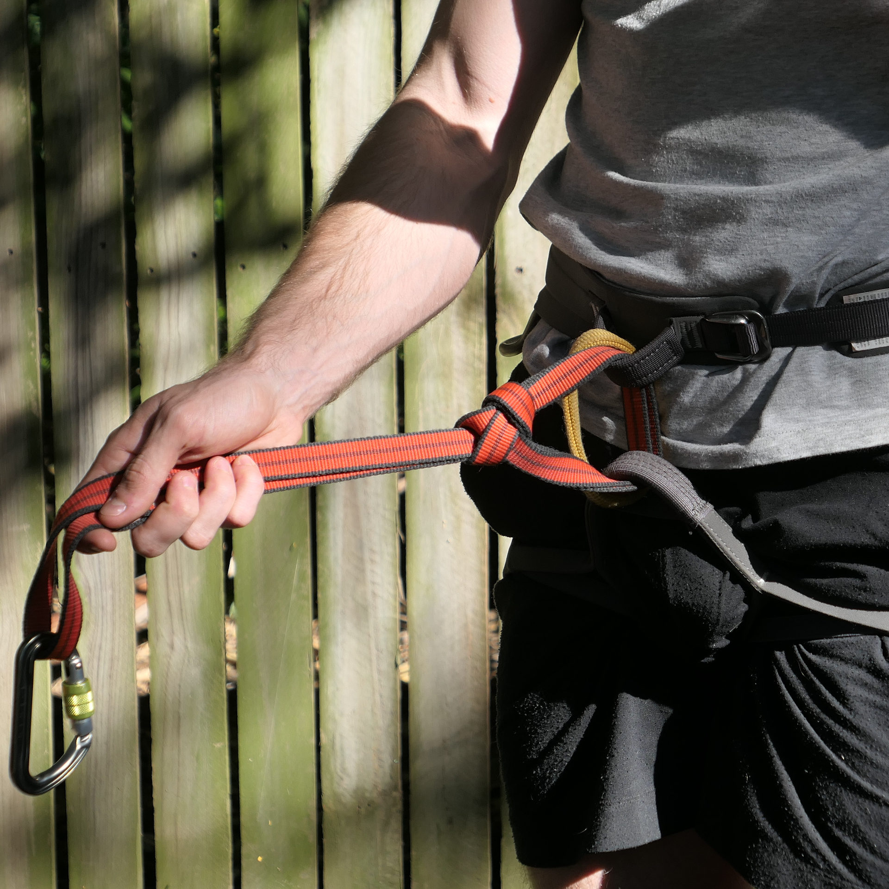
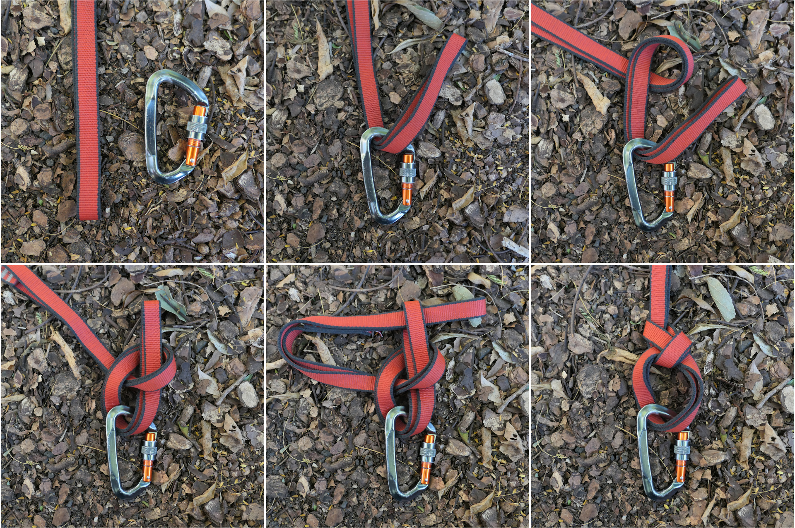

The backwards bowline is a technique I devised to tie the classic bowline on a bight in a sling without the inversion step.
This allows you to attach slings to a loop or large object.
One particular use is for personal tethers on a climbing harness.

The typical knot for this sort of thing is the girth hitch.
Using a bowline gives a few advantages, the loop doesn't contract and the knot is stronger.
On the other hand, the bowline is bulkier and more difficult to tie.

To tie the backwards bowline, first pass your sling through or around the object.
Make a loop in the standing end of the sling and pass the working end through this loop.
Pass the standing end through the working end to finish the knot.

