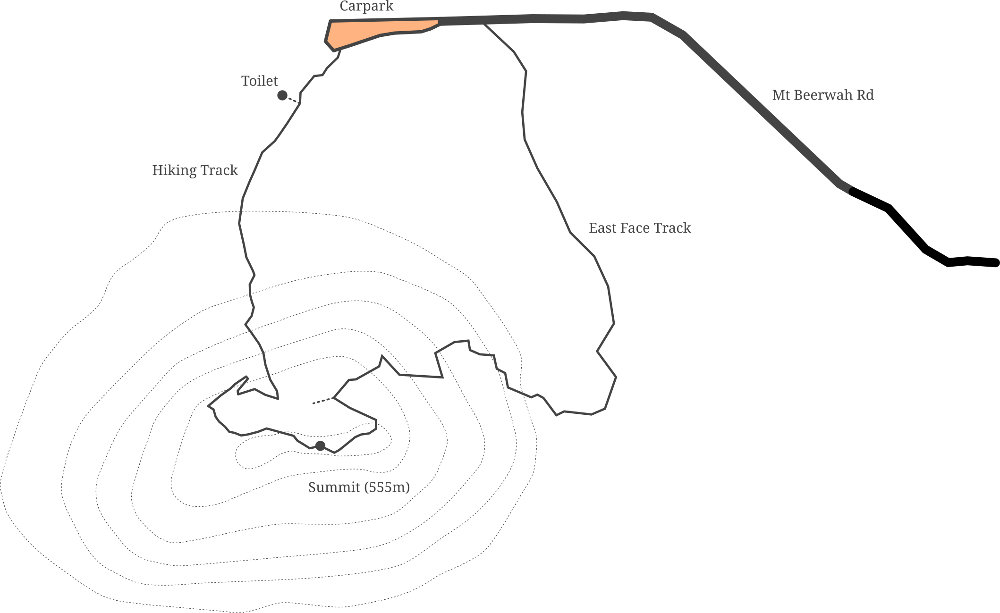
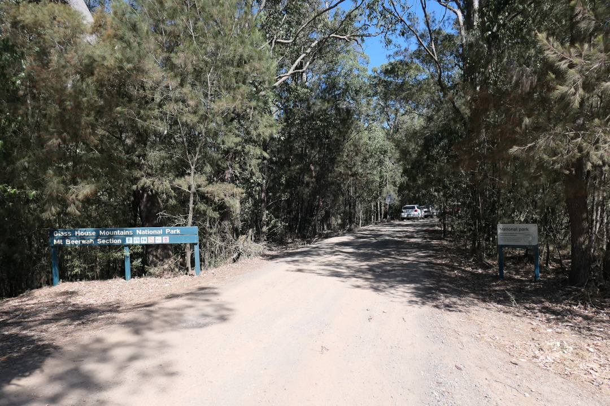
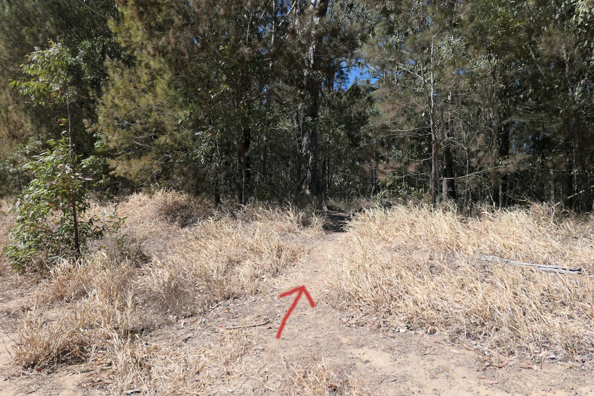
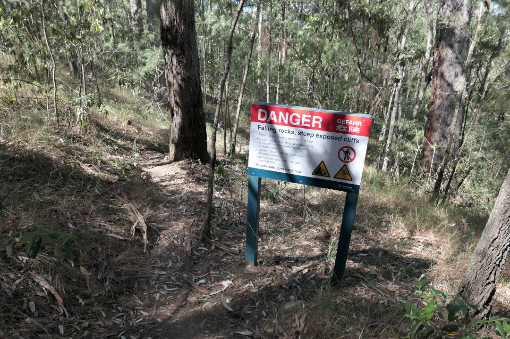
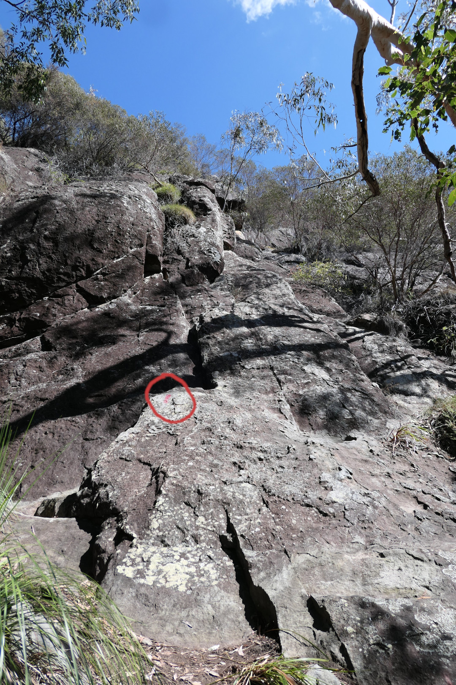
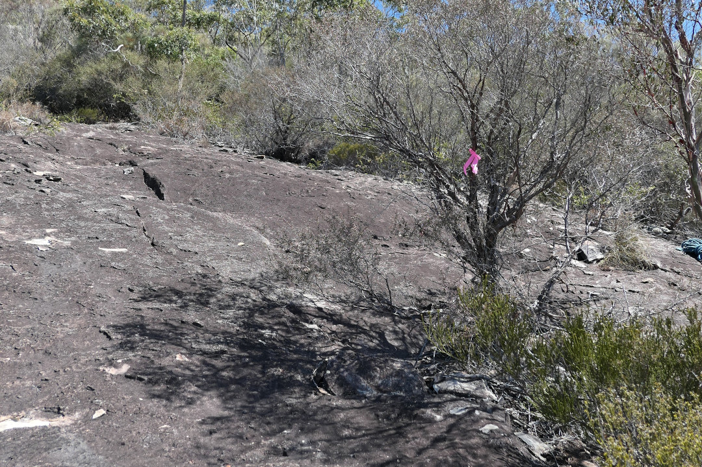
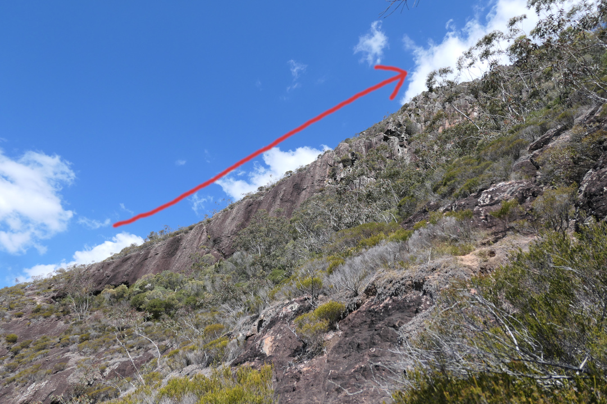
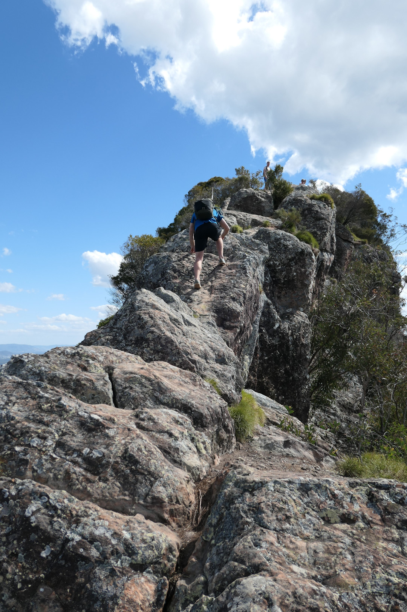

Mount Beerwah is the best hike near Brisbane.
It's an engaging scramble that leads you up a large slabby face, under the amazing 'organ pipes' and then on to the highest summit in the glasshouse mountains.
If, like me, you've done the Beerwah hike a bunch of times, consider giving the east face track a go.
This track is an alternative route to the summit of Mt Beerwah.
It isn't officially marked and requires a bit more navigation skill but is just a fun as the normal hiking track.
The scrambling sections are a blast and the walk over the ridge line at the top is truly spectacular.

There isn't much information around about the east face track.
I've written a bit here for those who want their adventure to be a little less 'adventurous'.
There's a mud map, a description of the route, GPS coordinates and some photos of key navigation spots.
Happy hiking!

## Map and GPS recorded track

The east face track leaves from a little before the Beerwah carpark and joins the main hiking track at the summit.

I'd like to stress that this track is very easy to navigate, even if it isn't an official hike.
Simply follow the markers to get yourself safely to the top.
If you'd like a little more help you can use the GPS coordinates provided below.
The coordinates are in a `.gpx` file which can be imported into any mapping app.

[Download the GPS coordinates: beerwah-east-face.gpx](beerwah-east-face.gpx)

## Navigation

The East Face Track begins from the usual Mt Beerwah carpark, Google maps will get you there easily enough.
Signs in the carpark lead you along a short path to some toilets and the normal hiker's track to the summit.
You don't want to follow this.
Instead head back to the entrance of the carpark and walk along the road you came in on.
At the top of the first rise in the road you'll notice a well worn track leading off to the bush on your right.
This is the start of the route up the east face.

Follow the track and you'll shortly come across a sign describing your impending doom if you continue.
Ignore it, but it is a good hint you're going the right way.

The track continues through a few gullys and eventually heads up to the start of the rock face.
It's well worn and easy to follow.
There is one point where you cross another faint track but just continue forwards.

Once you hit the rock slab look for the red stripe painted on the rock.
These red stripes go all the way up the route.
There's also pink and white flagging tape, and some white arrows scratched in the rock.
As you make your way up the scramble, keep an eye out for these markers so you don't lose your way.
If at any point you feel like you haven't seen a marker in a while take a moment and reassess.
There shouldn't be any point where the track is a true mystery.

At the end of the slabby sections you'll come across a small cave.
This is a great place to shelter from the sun and have a snack in peace.
Unfortunately you'll also have the opportunity to mutter about the sort of human filth that would scratch their names into the rock.

Just after the cave is the only true intersection on the track.
The left path takes you on a truly spectacular walk up the main ridgeline.
The right path is just as good but a fair bit trickier.
I'd suggest going left for your first time up.

After the intersection the track markers mostly disappear.
Fortunately from here on navigation isn't a problem.
Just follow the ridge to the top and enjoy the awesome view!

To avoid retracing your steps, you can decent via the hiking track.
This takes you right back to the carpark and on to home.

# Navigation Photos

Here are some photos of the key navigation points along the route for even more help finding your way.

Start from the Beerwah carpark and head back along the road.

Look for a track on your right at the first rise. 

The track is unmarked, but obvious. 

This danger sign lets you know you're heading in the right direction!

Once you reach the rock face look for the red paint strips and start scrambling. 

Look for pink flagging tape along the way. 

The track eventually follows this dramatic ridge all the way to the summit. 

The small cave about two thirds of the way up give some protection from the sun. 

The final ridgeline is the scenic highlight of the route!

