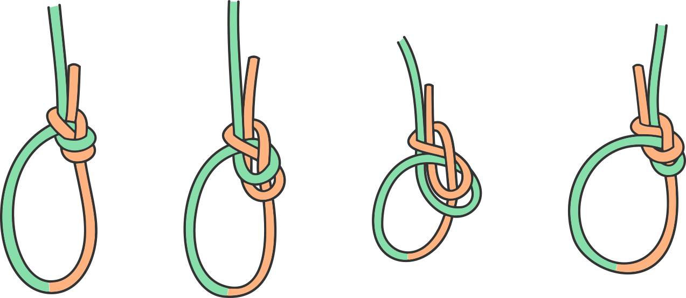

# The Seductive Bowline

The figure of eight is the perfect knot to attach a climbing rope to a harness. 
It's simple, bombproof and easy to learn. 
Despite that climbers are occasionally tempted by something else, something more exotic. 
The seductive bowline. 

The bowline and its variants have one big advantage over they figure of eight, they don't cinch tight when loaded. 
Take a few large falls on a lead climb and you'll see why this is tempting. 
Figure eight knots seize up easily and can be a pain to undo. 
It's not the end of the world, but jammed knots are annoying enough to motiviate climbers to look for an alternative. 

Unfortunately the advantage of the bowline is also its weakness. 
Because the knot doesn't cinch very tight it can shake itself apart when not under load. 
Imagine being halfway up a cliff and looking down to see that!
For this reason we're more interested in bowline variants. 
These knots are attempts to keep the structure of a bowline while locking the knot so that it can't untie itself. 

This page is a list of (almost) all the bowline variants I've seen around the place. 

The Bowline
=======

This is the bowline, the basic knot all the variations here build upon. 
Normally the bowline is taught with a mnemonic, something about rabbits running over logs and down holes. 
I've never had much luck with the rhyme and prefer to tie the knot by identifying its key parts. 
These are the twist around which the knot is tied, the bight 'choked' by the twist and the lock around the long end of the rope. 
If you visualise these features as you tie the knot you'll never get it wrong. 

On its own the bowline isn't a good knot for climbing. 
The problem isn't the strength of the knot. 
Bowlines and figure of eight knots reduce the breaking force of a rope by similar amounts. 
The exact numbers vary depending on the cord used, but they're in the realm of 80% for the eight and 75% for the bowline. 
No, the problem with the bowline is that it's unstable. 
If the knot is unloaded and shaken around, or repeatedly loaded and unloaded, it can untie itself. 
Bowline variants seek to lock the knot off so this can't happen. 

Bowline Variants
==============

The following knots are variations on the bowline. 
They each keep the same fundamental structure but add extra twists and turns to lock the knot off. 
These variations are in an interesting place. 
I've seen people climbing on all of them, but none of them could be considered 'official'. 
They're here as a curiosity, not a recommendation!

On top of looking for something strong and stable, there are a few other properties we'd like for a tie-in knot. 
Any tie-in knot should be ubiquitous, simple to learn and easy to verify. 

The first request is a total write-off. 
None of the bowline variants have anywhere near the popularity of the eight and there's a good chance any climber you pick at random won't know a single one of these knots. 
That said, this changes depending on location, experience and the 'clique' you're climbing with. 
The second is a funny requirement. 
I would say that all of these knots are easy to learn, yet I've had friends who struggle to remember the rethreaded eight. 
Obviously some of the variations are going to be simpler than others. 
Whether any of them are truly simple is anyone's guess. 
The last property also tricky. 
In fact, I'd say that reading this page is going to make it much harder for you to verify your bowline of choice. 
Fair warning, many of the different knots here look awfully similar. 

Bowline with Stopper
--------------------

One of the simplest ways of reinforcing a bowline is by adding a stopper knot. 
Although I have seen people climb with a plain bowline and stopper, it's a little too spartan for my tastes. 
The standard stopper is the double overhand knot. 

Having the stopper knot inside the loop is a bit of a pain. 
Most of the other variations allow you to tie a stopper out of the way on the main strand of rope. 
I haven't drawn stopper knots in any of the other diagrams on this page, but typically you'd use one with any form of the bowline. 

Double Bowline
--------------

Doubling the loop around which the bowline is tied creates a double bowline. 
This variation is a little more resistant to loosening but doesn't offer that much over the regular bowline. 
Rather it's a building block for several other variations. 

Yosemite Bowline / Bowline with Yosemite Finish
-----------------------------------------------

The Yosemite bowline is one of the most famous bowline variants. 
With a name like that you can imagine that it's well loved by climbers. 
More than almost any other knot on this page it has a long history of use for tying in. 
That's certainly comforting!

This knot is quite fiddly and in my opinion it's one of the hardest variants to tie and recognise. 
On the other hand, since the end of the rope emerges parallel to the main strand the stopper knot can be tied in clear view. 

There is a slight issue with the Yosemite bowline. 
If the knot is tightened improperly, or if the knot comes loose and reforms, it's possible to create something that isn't a bowline. 
It's not clear whether this actually happens in practice and whether the resulting franken-knot is actually dangerous. 

Double Bowline with Yosemite Finish
-----------------------------------

The Yosemite finish can also be tied around the double bowline. 
This variant cannot reform like shown above for the standard Yosemite bowline. 

Double Bowline with Tucked End
------------------------------

This method of securing the double bowline puts the tail of the rope out of the way and allows you to easily tie a stopper knot. 
It's also easy to learn and simple to inspect at a glance. 
To see what's going on, it's better to view the knot from behind. 

End Bound Double Bowline
------------------------

This is another simple lock based on the double bowline. 
It's similar to the tucked bowline but a little more secure. 
I don't really like that the end doesn't come out parallel to the main strand, although I suppose you could combine this with the tucked bowline. 

Rethreaded Bowline / Bowline on a Bight
---------------------------------------

The rethreaded bowline is probably the most commonly used bowline variant. 
If you look carefully while watching Youtube videos, you'll notice a lot of pro climbers using it!
The knot is conceptually simple, has a distinctive shape and is easy to inspect. 
This is the bowline I was taught when I started climbing. 

Unfortunately there are a few downsides to this knot. 
It takes quite a while to tie and the main loop of the knot is doubled. 
This can be a pain to thread through the tie-in points on a harness and people often use the belay loop instead. 

While you'll need to rethread to tie in to a harness, the same knot can be tied without access to the end of the rope. 
This is why the knot is typically called the 'bowline on a bight'. 

Woven Bowline
-------------

This knot is usually referred to as "Scott's simple lock" after its inventor. 
I quite like the name 'woven bowline' instead as it neatly describes how the knot is formed. 
Staring at a loose bowline you can find three parallel strands of rope crossing through the knot. 
The woven bowline is formed by weaving the end of the rope through these three strands - over, under, over. 

The woven bowline is my personal favourite bowline variation. 
It's an elegant concept that results in a knot which is easy to tie and has a distinctive shape. 
I hope someone does a whole batch of serious tests on this knot so it can spread far and wide. 

End Bound Single Bowline With Yosemite Finish
---------------------------------------------

This is a good contender for the ultimate climbing bowline. 
It's strong, stable and easy enough to tie. 
I found this knot described by [PACI](http://www.paci.com.au/) who have done quite a few tests on it. 
It combines the looped end of the EBDB with a Yosemite finish. 
I suspect it has the potential to gain a cult following amongst climbers although it will never replace the eight. 

Should I use the Bowline?
=========================

No. 

That's the simple answer. 
Using the bowline as a tie-in knot is a surprisingly controversial topic. 
Some people are passionately opposed to it with all the vitriol that only the internet can bring. 
I'll briefly outline the arguments against the bowline. 

- The bowline and its variants are more difficult to tie than the figure of eight knot. 
Making a mistake while tying in could lead to an accident. 

- The figure of eight, with its distinctive shape, is much easier to visually check than the bowline and its variants. 
This is important both for your partner and for double checking after cleaning a route. 
Furthermore the existence of so many bowline variants makes it hard to be sure what knot you're looking at. 
Go back and take a squiz at the tucked double bowline and the Yosemite bowline. 
Think you could tell which is which at a glance?

- The figure eight is ubiquitous, every climber knows it. 
The bowline and its variants are more esoteric and it's not guaranteed that your partner will know the knot you're using. 
If they can't double check your knot you've lost an important bit of redundency. 

These are all valid concerns and you'll have to decide what's right for yourself. 
Personally I take a fairly conservative approach. 
That is, use the eight as a default knot and switch to the bowline occasionally if two conditions are satisfied:

1) Climbing single pitch sport routes where I expect to fall often. 
2) With a partner who knows the knot I'm using. 

