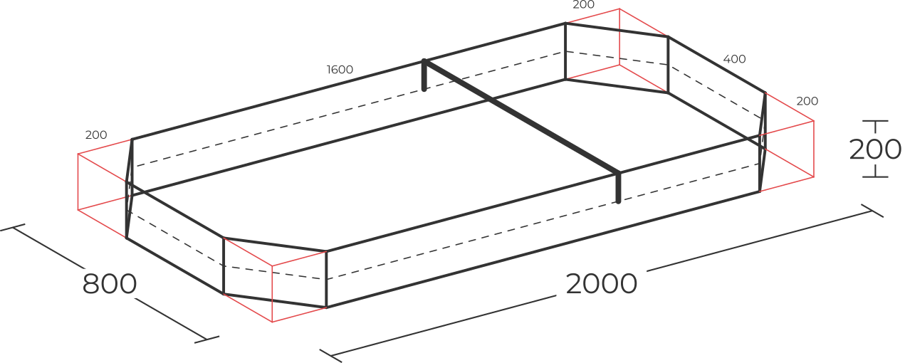
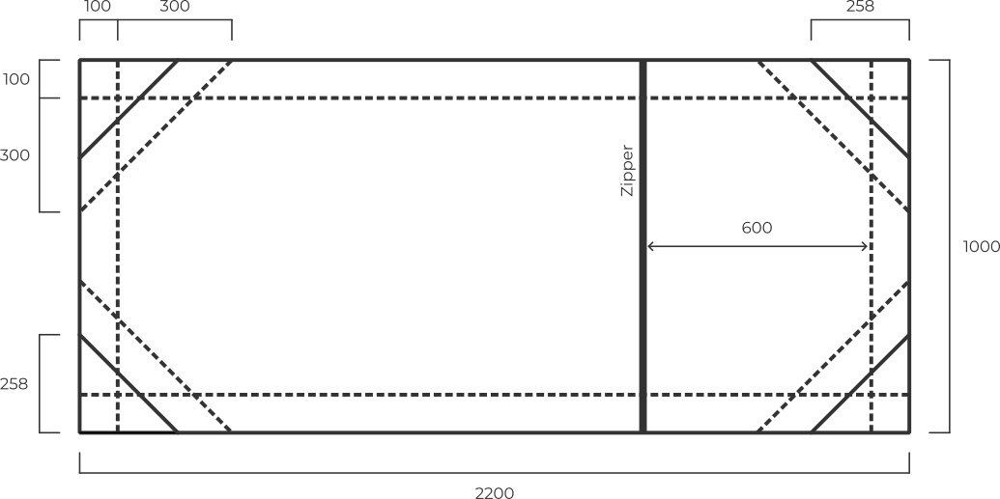
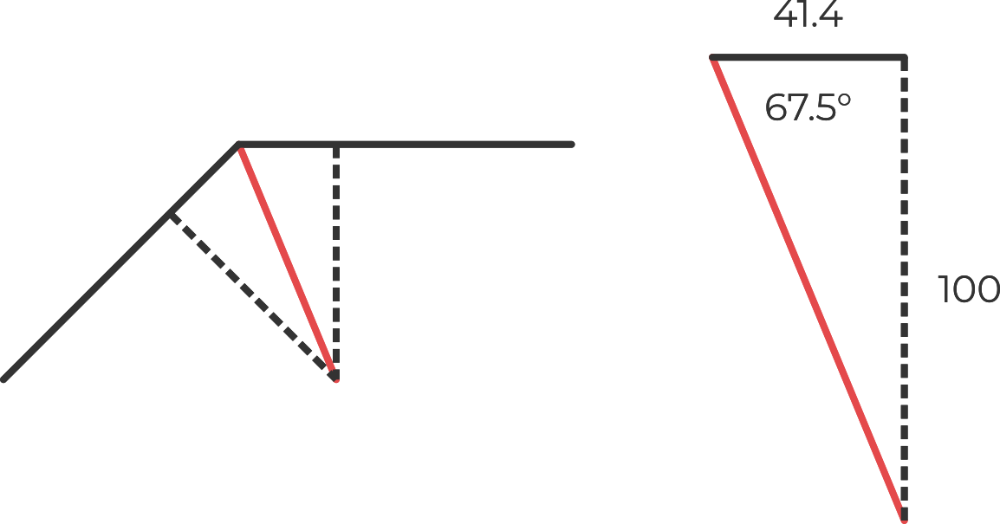

For a hiking shelter with the perfect balance between versatility and light weight it's almost impossible to beat the tarp and bivy combination.
With this setup you use a rectangular tarp with attachment points around the edge for rain protection and a bug bivy below to keep of the ground and keep out mosquitoes.
Unlike alpine bivys, which are standalone shelters designed for low humidity alpine environments, bug bivys are just a combination groundsheet and mosquito net.

My bug bivy is built in one of the simplest styles.
It's based on a rectangular envelope of fabric with a single zip across the middle.
The bivy is divided into two pieces of fabric with a waterproof groundsheet on the bottom and a mosquito net on the top.
Entry to the bivy is through a single zipper in the mosquito netting that sits across the chest.
I like to adjust the basic rectangle by trimming the corners to create an octagon and adding darts to form sides of the bivy.

Both sides of the bivy have the same basic shape.
Cut the waterproof material and the bug netting to a rectangle following the diagram below.
It's a good idea to add the zip to the mosquito netting first.
Cut two pieces of material a little larger than needed and then re-measure and cut the entire assembly afterwards.
When you're installing the zipper it's tricky to keep everything exactly in line and sized correct.

It takes a little work to form the final shape of the bivy.
First sew around the edge of the fabric to join the two pieces.
Leave the zipper a little open so you can easily turn the final bivy inside-out.
After you've joined the two rectangles; mark, sew and trim the corners.
This creates the basic octagon shape.

To bring the bivy out into three dimensions, we'll need to add darts to the eight corners.
There's a classic trick to form a box from two pieces of fabric.
First sew around the edge to join the pieces and the press the corner out and fold it to create a new corner 45° from the original.
Sew across the new corner, trim the fabric, and you'll have a box in the corner.

The box trick is almost always done with a right angled corner.
There's no real reason why it has to be, it's just simpler.
For this bivy we need octagonal corners.
To sew these easily, you can measure out 42mm from the corners and extend lines parallel to the edge of the fabric.
Do this on both sides and then stretch the corner between the two spots where the two lines meet.
Sew across the corner and trim.

