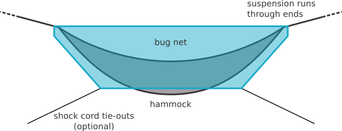
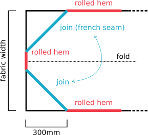
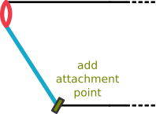

This detachable bug net can protect your hammock when you need it, or be left at home when you don't. 
It uses a single sheet of mosquito netting. 
'Noseeum' seems to be the best stuff around. 

The net is essentially a piece of noseeum folded over the ridge-line of the hammock, with your suspension running through each end. 
If you let gravity do it's work the net should hang tight around the hammock, but if you'd like to attach it more firmly there are several options. 
You can run elastic through the bottom channel, or use shock cord tie-outs to pull the net down. 
My favourite option, and the one most in keeping with the ultralight spirit, is to tie shoes to the attachment points. 
These pull the net nice and tight. 

Cut out the net and hem the edges, then simply fold it in half and join the diagonals. 
It's not necessary, but can help to attach a small piece of fabric as edging around the suspension loops. 

