With climbing gyms closing and a pandemic raging, a few friends asked me to build them portable hangboards to get strong while stuck at home.
These boards are simple but effective and I imagine there are many people out there who would appreciate something similar.
After all, we're all desperate not to lose our climbing mojo!

During the lockdown I've been selling these hangboards to climbers in Brisbane, take a look [here if you'd like to buy one](/covid-19-hangboard/).
For anyone living elsewhere, looking for something cheaper or just after a project to keep themselves busy, I've written instructions for a more primitive version of the board below.

This simple hangboard uses cheap timber in standard sizes that you can find at your local Bunnings.
It only requires a handful of tools and an hour or so of work.
Despite the simplicity, it's a great board and will provide everything you need to get strong.

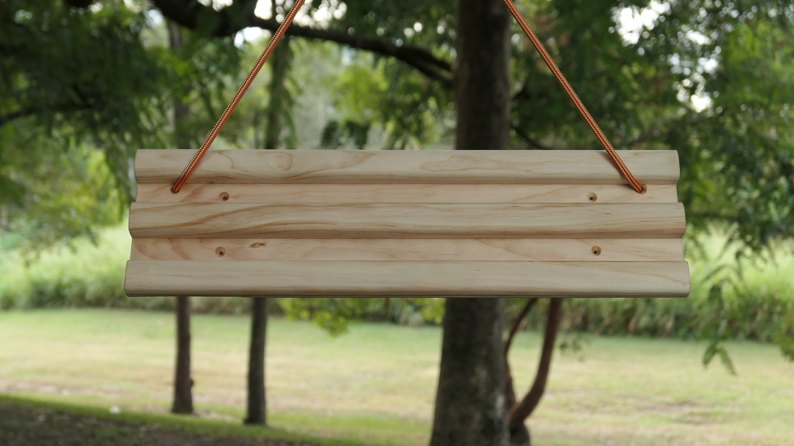

## The Design

The hangboard has three rungs which form large, medium and small edges.
Moving down the three rungs and progressing from two- to one-handed hangs will challenge all but the strongest climbers.
You can also wrap your hand all the way over the top as a jug for warming up.

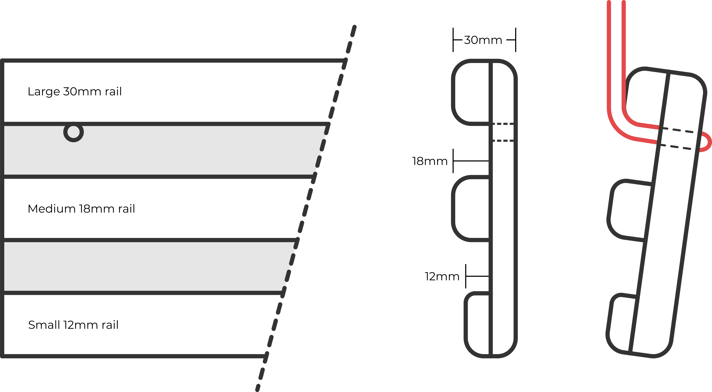

This is a portable hangboard that dangles from a rope and can be clipped anywhere.
Most homes should have somewhere to hang the board, whether that's a doorframe pull-up bar, a tree branch or a joist in the ceiling of your verandah.
Given how many people rent it's nice not to need to screw the board into a wall.

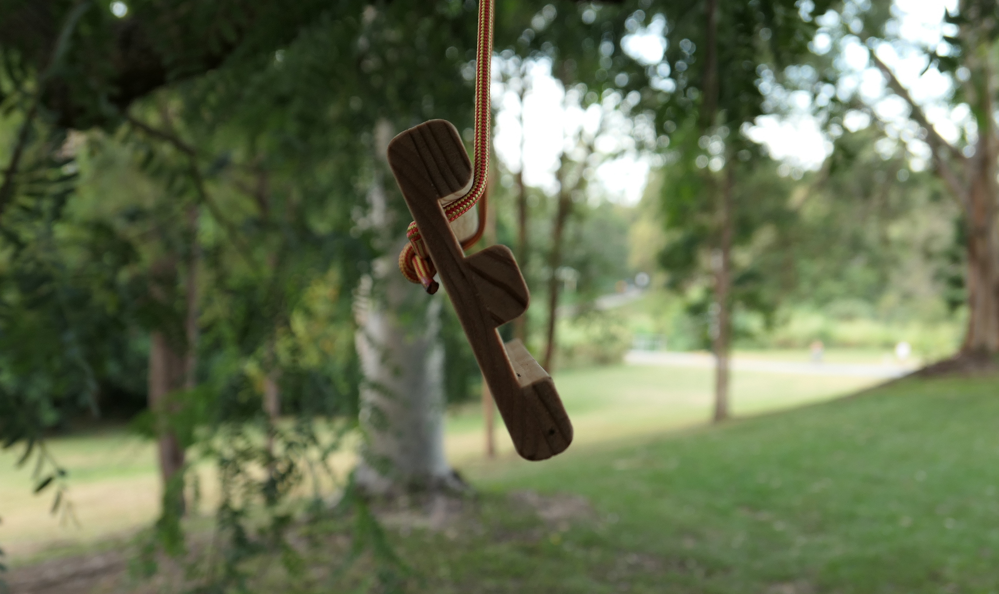

The suspension rope rolls over the top rung of the hangboard to tilt the board slightly.
This simulates an incut on the edges and makes the entire construction much simpler.

## Materials and Tools

The hangboard uses standard timber lengths from Bunnings along with a handful of screws and a length of rope.
All together the materials for one hangboard should set you back a bit under $20.

Unfortunately you can't really buy the wood for just a single hangboard.
The shortest pieces of timber you'll find are 1.2m lengths, so chop them in half and share with a friend.
As with everything you'd save money if you buy in bulk, but then what would you do with all the leftovers?

In total we need $29.00 for enough timber to make two hangboards.

- 1x Dressed Pine 140x12x1.2 ($9.00)
- 2x Dressed Pine 30x18x1.2 ($14.00)
- 1x Dressed Pine 30x12x1.2 ($6.00)

The biggest challenge with screws will be finding a small enough box.
Again, it's probably best to share with someone else.

- 8x 25mm countersunk timber screws
- 4x 20mm countersunk timber screws

Almost any hardware store rope will be strong enough to hang from, but I'd opt for climbing accessory cord anyway.
That way you can reuse it at the crag for something more fun later down the line.

- 1.5m 7mm accessory cord

You won't need many tools to build one of these hangboards.
These are the few you (probably) can't do without.

- (Hand) Saw
- Drill
- 8mm drill bit
- 2.5mm drill bit (or 2mm or 3mm, pine is forgiving)
- Screwdriver or driver bit
- Wood glue
- Sandpaper
- Ruler
- Pencil

Beyond that, a couple of clamps or a vice will make screwing the rails on much easier, but they aren't necessary.

## Construction

Cut the four pieces of timber to length.
You can make your hangboard as long as you'd like but I've found that 500mm is perfect.
Throughout the rest of the instructions I'll assume you've used this length.

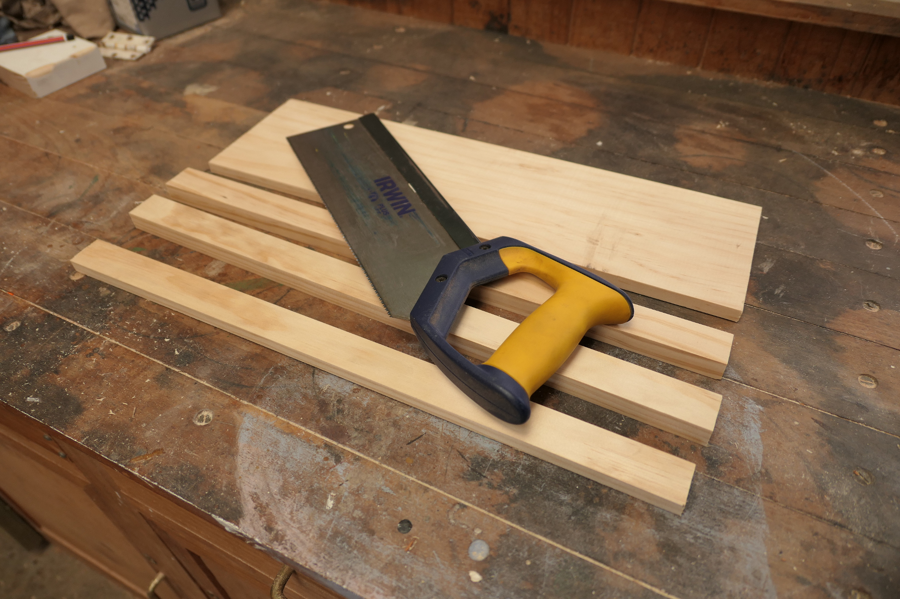

Mark the holes on the large backing board.
We need twelve holes to attach the rungs and two holes for the rope.
Measurements are in the diagram below.
Of course, the screws don't have to be evenly spaced, but come on...

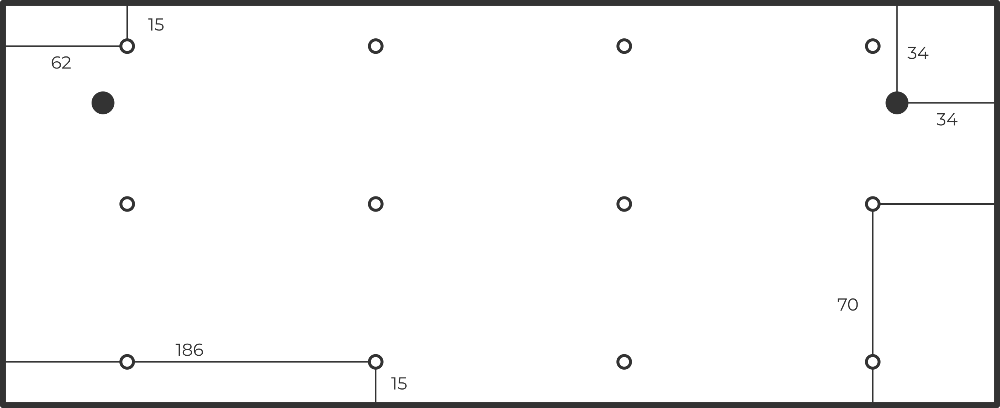

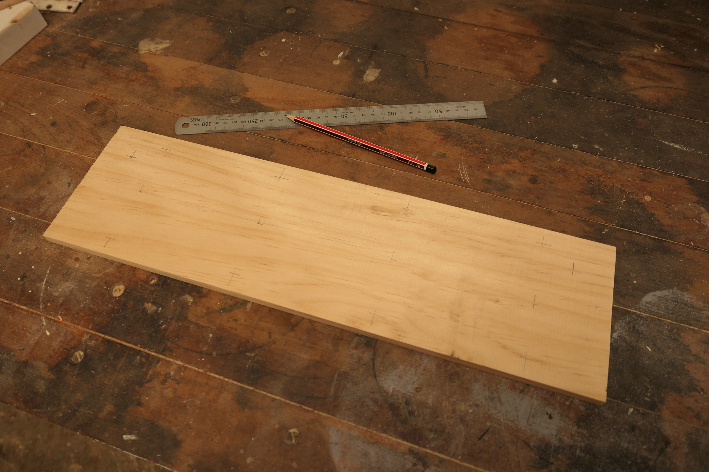

Drill the two rope holes with an 8mm bit.
You may like to use a small piece of sandpaper to soften the edge of the holes where they will pull against the rope.

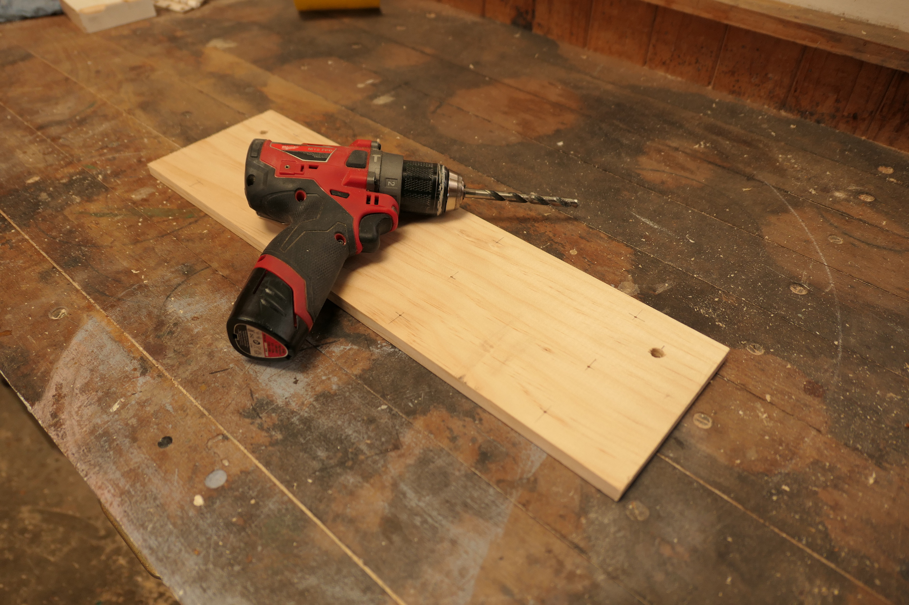

Round the edges of your rungs with sandpaper and a block of wood.
You want the edge to be fairly comfortable as you pull on it.
The limiting factor when hangboarding should be strength, not pain tolerance!

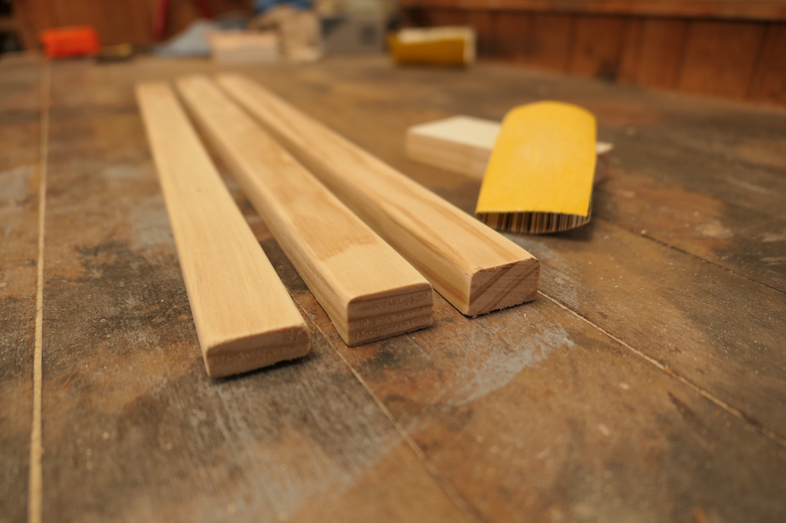

Start sanding with your paper wrapped around a block of wood to take off the bulk of the material.
Then switch to your fingers to nicely round the edge.
You can speed up the whole process by using a variety of papers.
I used a coarse 60 grit paper to begin and then finished with a 100 grit paper.

Glue, clamp, drill and screw the rails one by one.
The top and bottom rails are easy to line up but to center the middle rail you'll want to measure in 55mm from either edge.
Make sure that the 12mm rail is furthest away from the rope holes.

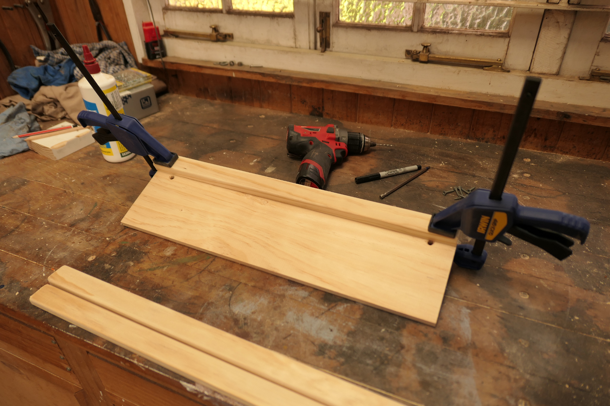

You only need to use a small line of glue.
The glue is there to add a little extra strength but the bulk of the weight is held by the screws.
I've made ones without any glue and they're still robust enough.
If you use too much glue clean it out from between the rails straight away - cleaning up dry glue is much more work.

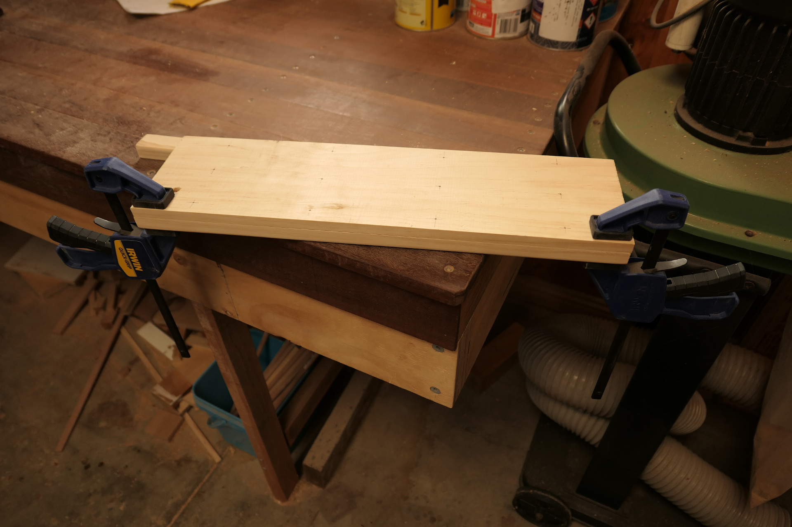

You can screw the rails on without clamping them, but it will be much more difficult.
One option is to hold them in place with a weight until the glue has dried and let that keep them still while you drill.

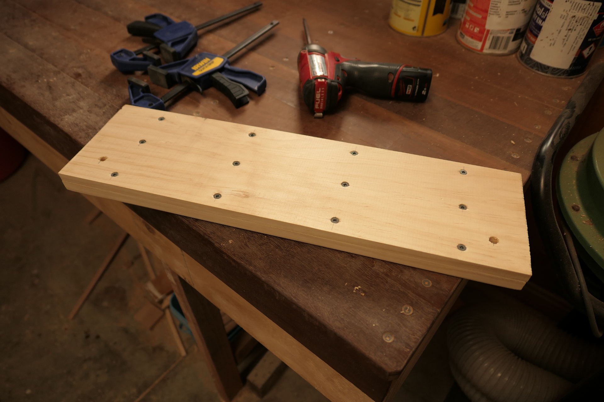

Thread the rope through the two large holes and join it with a double fisherman's bend.
You could also use an overhand bend, a Flemish bend, or whatever takes your fancy.
You want the knot to sit behind the hangboard and the rope to pass over the top rail.

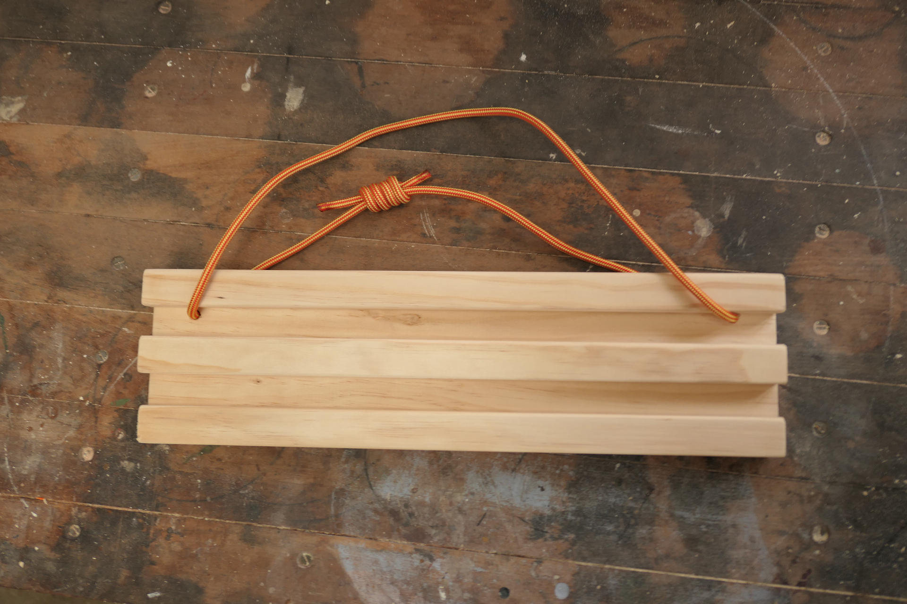

That's the hangboard completed!
As easy as it was, this simple board has everything you'll need to get strong during the lockdown.

## Minor Improvements

There are plenty of things you can do to make the hangboard a little more fancy.
None of these are particularly difficult, it just depends on whether you have the tools available.

- Use a router to round the edges instead of sandpaper.
  This will give a neater edge, better control over the radius of the curve and is a heck of a lot less work.
- Instead of cutting the boards to length at the start, leave them a little longer and then cut the entire board at the end.
  This ensures that everything will line up perfectly on the side of the hangboard.
- Countersink the drill holes.
  This is particularly helpful around the rope holes as it gives a nicer surface for the rope to pass over.
  Pine is fairly soft so you can drive the screws straight into the board but a small countersink is helpful here too.
- Add holes between the rungs so you can mount the hangboard to a wall if the option presents itself.
- Use nicer timber so the board lasts longer and looks better.
- Lightly oil the timber if you're leaving it hung up outdoors.
  This will protect it from the elements, bring out the detail in the wood and shouldn't be slippery.
  Indeed you'll naturally 'oil' the timber with your sweat as you use the hangboard!

Below you can see a board built exactly with the instructions above, a 'premium' version, and one of my beautiful hardwood boards.

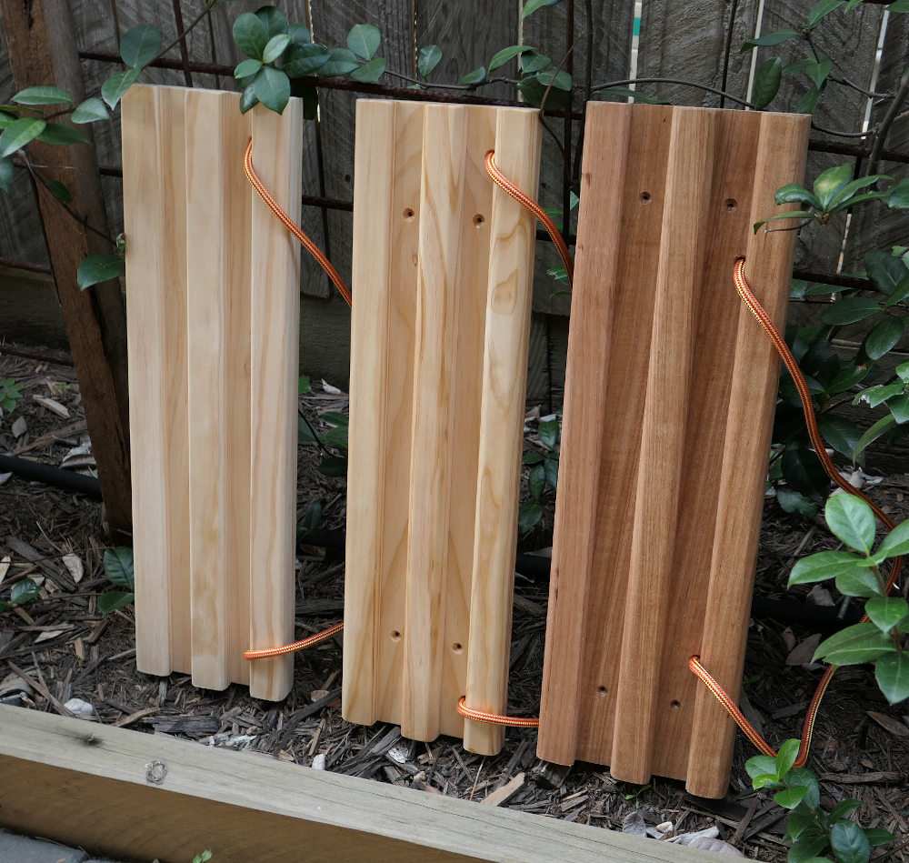

## Selected Hangboarding Resources

Enjoy your hangboard.
There's more advice out there than you could possibly consume, so here are a few good places to start.

- [David MacLeod's Hangboarding Video](https://www.youtube.com/watch?v=VeKE5VH5-qg)
- [Podcast with Tyler Nelson Describing a Nifty Hanging Technique](https://www.trainingbeta.com/the-simplest-finger-training-program/)
- [Hangboarding Article from Tension Climbing](https://www.tensionclimbing.com/hangboarding-a-way/)
