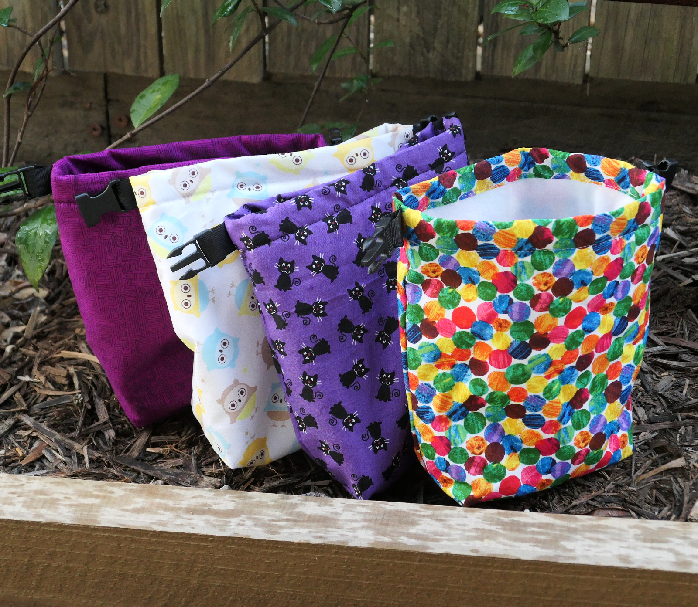
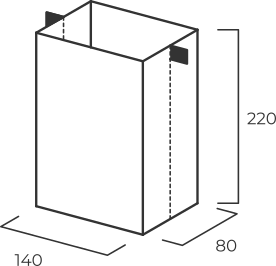
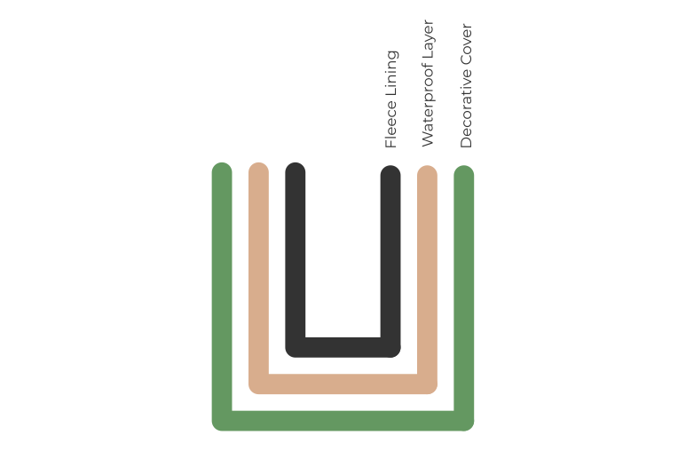
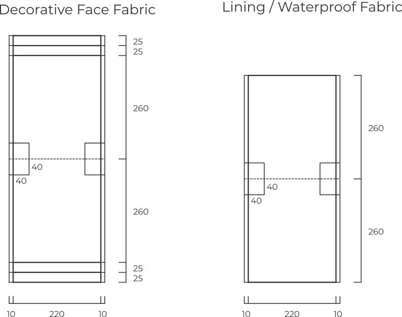

# Chalk Bags

There are tons of different chalk bags out there, from high-tech twist lock bags to repurposed stuffed animals. 
I prefer something simple, essentially a lined roll-top bag. 
These bags do a better job of keeping the chalk inside than anything else which is nice if you throw the chalk bag in amongst other things. 

These bags are sized to comfortable fit a hand and hang from a belt. 
The rectangular shape isn't any less practical than a round bag and I haven't found a stiffener around the rim to be necessary. 

I like to use three layers of fabric to form the bag. 
The inner layer can be any soft wicking fabric to distribute the chalk and feel good on your hand. 
Something like polar fleece is perfect. 
The middle layer is a waterproof material which keeps the chalk inside and moisture out. 
Since this layer isn't visible, it's a good chance to recycle some material from an old tent. 
The outer layer determines the look of the bag, use whatever takes your fancy. 

There are two slightly different patterns used for the outer and inner layers. 
The inner layers are exactly the size of the finished chalk bag, while the outer layer has extra fabric on top to roll down and form the collar. 

The construction is very simple - you can probably work it out from just the picture. 

- For each layer, form a squared off bag by folding the fabric, sewing along the edges, inverting the corners and sewing along the diagonal. 
- Make sure to sew the webbing and buckles into the seam of the decorative layer, just below the hem. 
- Turn the outer layer inside-out, so that the seams are on the inside. 
- Place the three bags inside each other. 
- Roll down the rim of the outer layer and sew it in place. 

