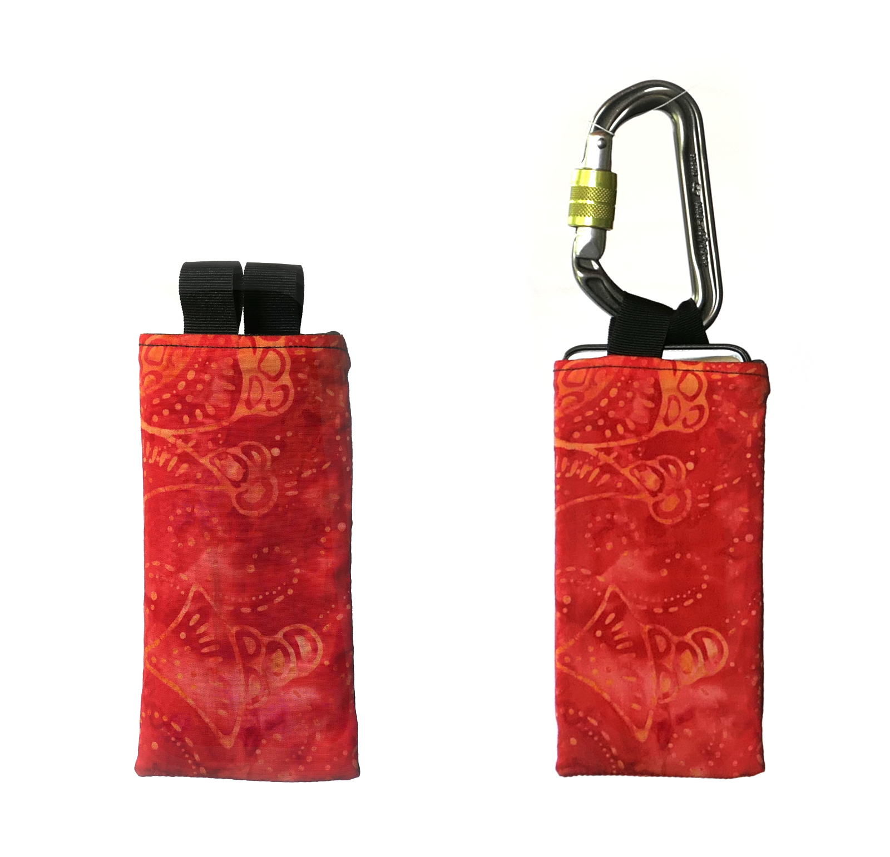
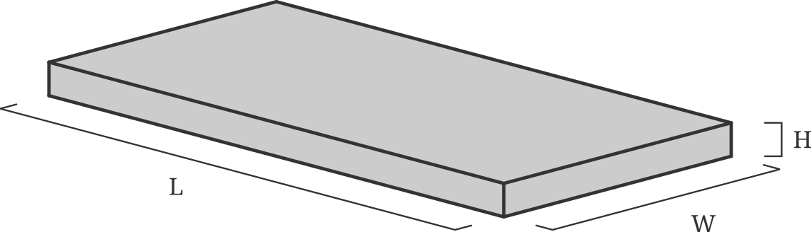
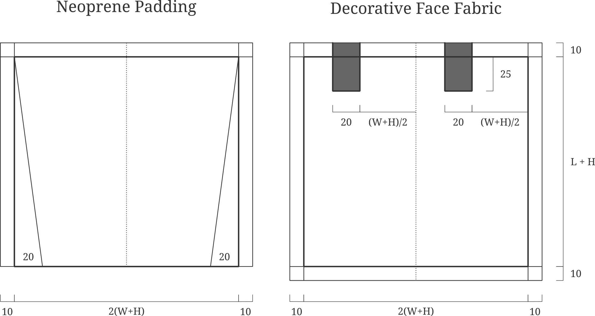
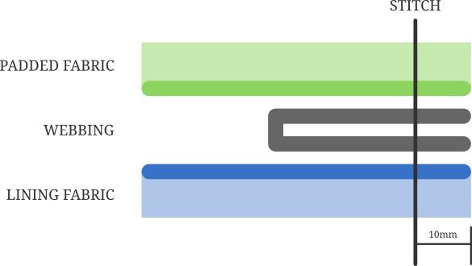
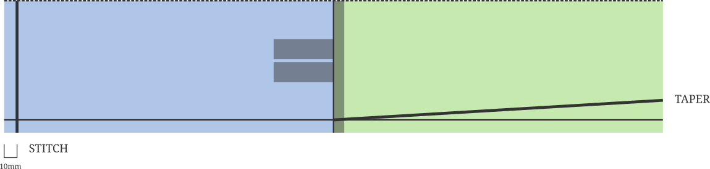

# Climbing Phone Pouches

Where do you put your phone if you want to take photos from the top of a climb?
It's a surprisingly tricky question. 

Side and back pockets on your pants aren't much good, the phone will get squished under your harness. 
Painful and likely to damage the phone. 
Some clothes have pockets at the elbows or knees but the phone is going to take a battering as you climb and I don't often wear long clothes climbing. 
You could drop your phone in your chalkbag, but I'd be worried about it falling out or the getting gummed up with chalk. 

With this in mind I've designed a simple padded pouch to hang your phone from your harness. 
It works well enough for taking a few quick snaps at the top of a climb. 

The pouch design is so simple I'm embarrassed that it took me a bunch of prototypes to perfect. 
You can easily make your own using the pattern here. 

Design
======

The phone pouch uses two different materials, a lining and a face fabric. 
The lining should be made from a stretchy padded material. 
Thin neoprene is perfect, but otherwise you could use some fleece or felt. 
Anything can be used for the exterior fabric, from decorative cottons to a minimalist's black canvas. 
You'll also need two short pieces of webbing to make the carabiner attachment. 
I use 70mm lengths of 20mm webbing. 

## Measure Phone

Since you're making your own pouch you can scale the design to fit your phone perfectly. 
The pouch should be snug but not overly tight. 
Measure the length, width and height of your phone and use these values in the pattern. 

## Mark and Cut Out Fabric

Both pieces of fabric are simple rectangles. 
Measure out the pattern with a ruler following the dimensions below. 
Make sure to leave a 10mm seam allowance on every side. 
(The bottom of the padding doesn't need a seam.)

## Sew the Main Seam

Lay the decorative fabric face up on a table and pin or tape the webbing loops in place. 
Put the padded material face down on top of the other piece. 
The 'good' sides of the fabrics should be facing each other with the webbing sandwiched in between. 
Sew across the top seam. 
If either of the two fabrics are prone to fraying, follow along the seam with a zig-zag stitch. 

## Sew the side Seam

Open the two pieces out and fold in half along the length of the pouch. 
Make sure that the good sides of the fabric are on the inside!
Stitch along the entire length to create a tube. 
Follow with a zig-zag stitch if required. 

## Finish off the two ends

The two ends are finished in different ways. 
The face fabric is sewn closed by stitching across the end of the tube. 
Taper the padded tube to prevent it from bunching up inside the pouch. 
How much taper is required will depend on the material you're using. 

## Invert the Tube

To finish off the pouch we need to turn everything inside out. 
Push the face fabric through the tube and then push the padding half inside. 
Jiggle around with a ruler or chopstick to poke the corners out and make the pouch sit flat. 
(At this stage you may need to go back and trim the end of the padded material or taper it further.)

Process Pictures
================

Add Photos

