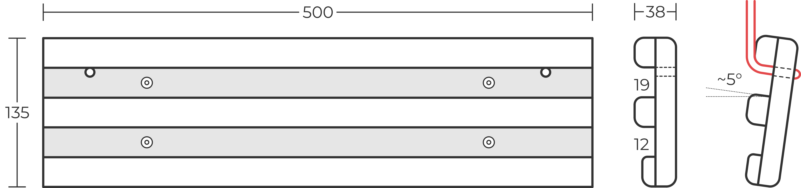
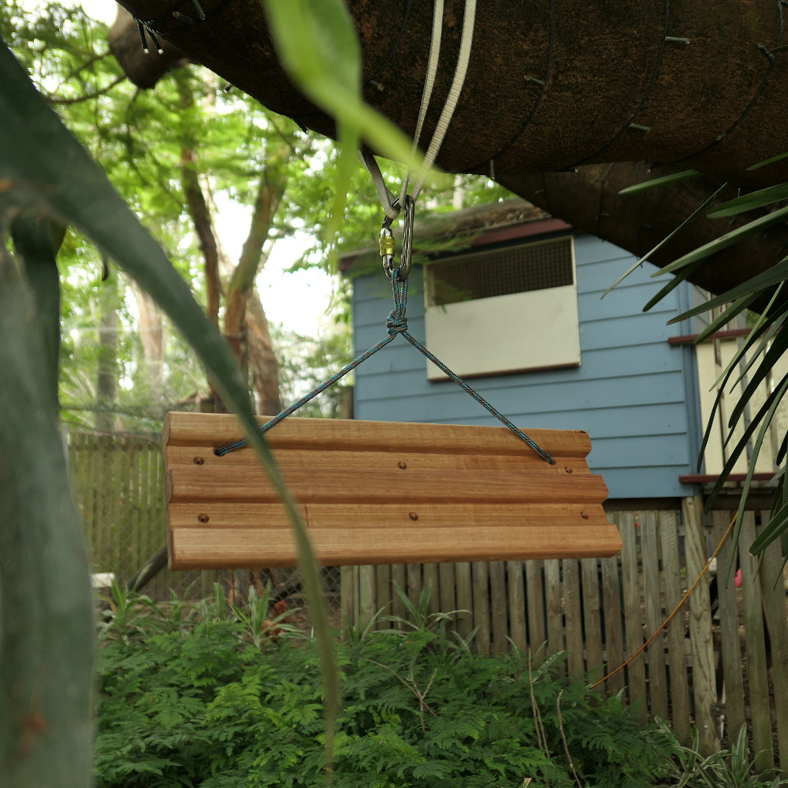
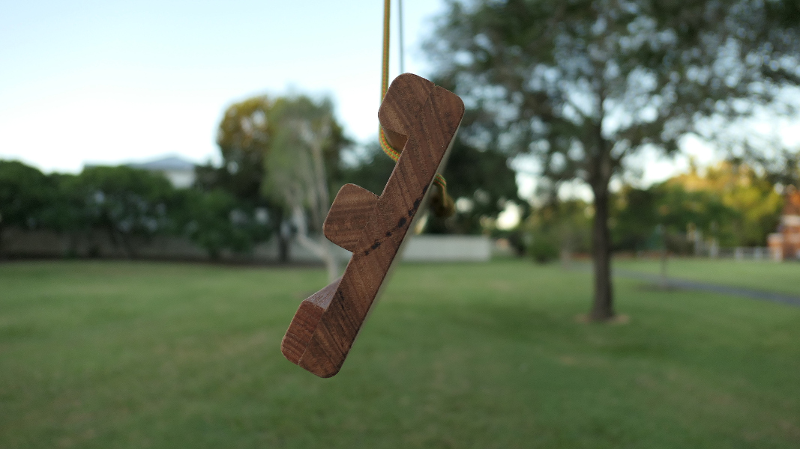
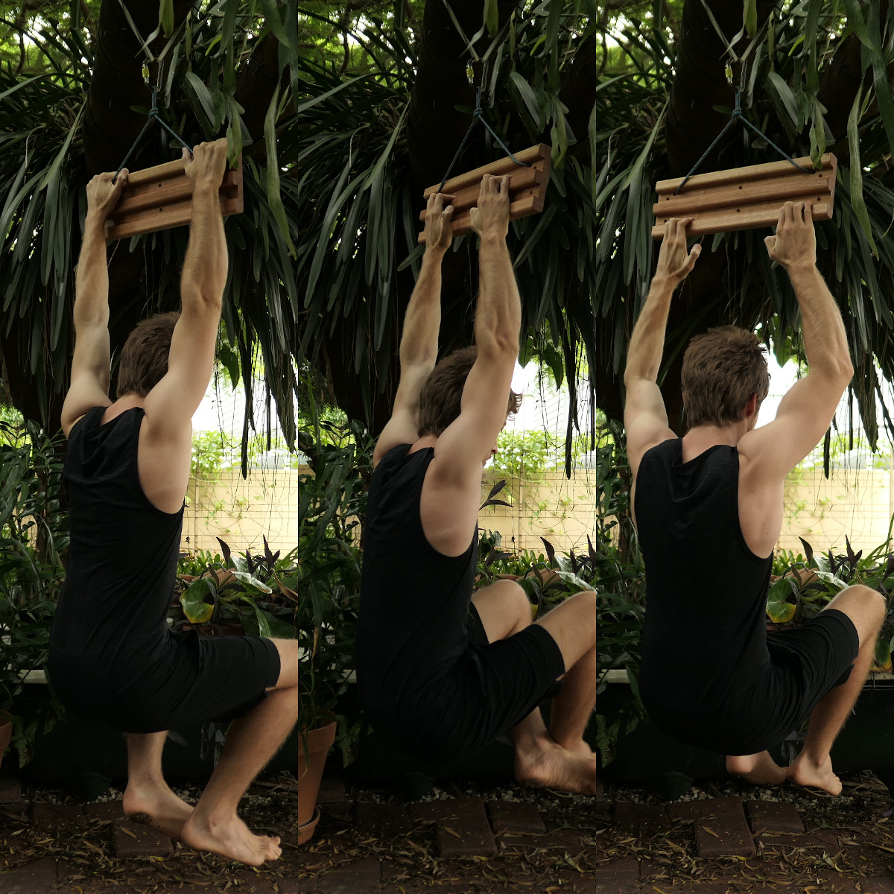

# Covid-19 Hangboard

An elegant portable hangboard that can be hung anywhere to keep you strong during the Corona Virus lockdown. 

- Three comfortably shaped edges give plenty of room for progression. 
- The board can be screwed to a wall or hung from a rope, great perfect for renters. 
- Perfect 'angle of the dangle', it always hangs well without any adjustment. 
- Built from Tassy oak so it looks great, mount it in your living room for a little extra motivation to train. 

I'm selling these during the pandemic to people in Brisbane for $100, send me a message at *hangboards@tojahech.com* if you'd like one. 
I've also written some instructions on how to make your own slightly more primitive version of the same board [here](/build-a-hangboard/). 

