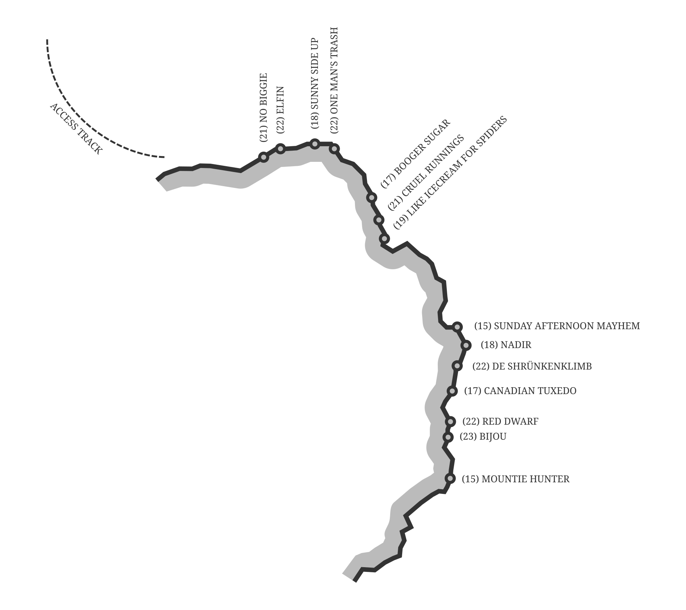
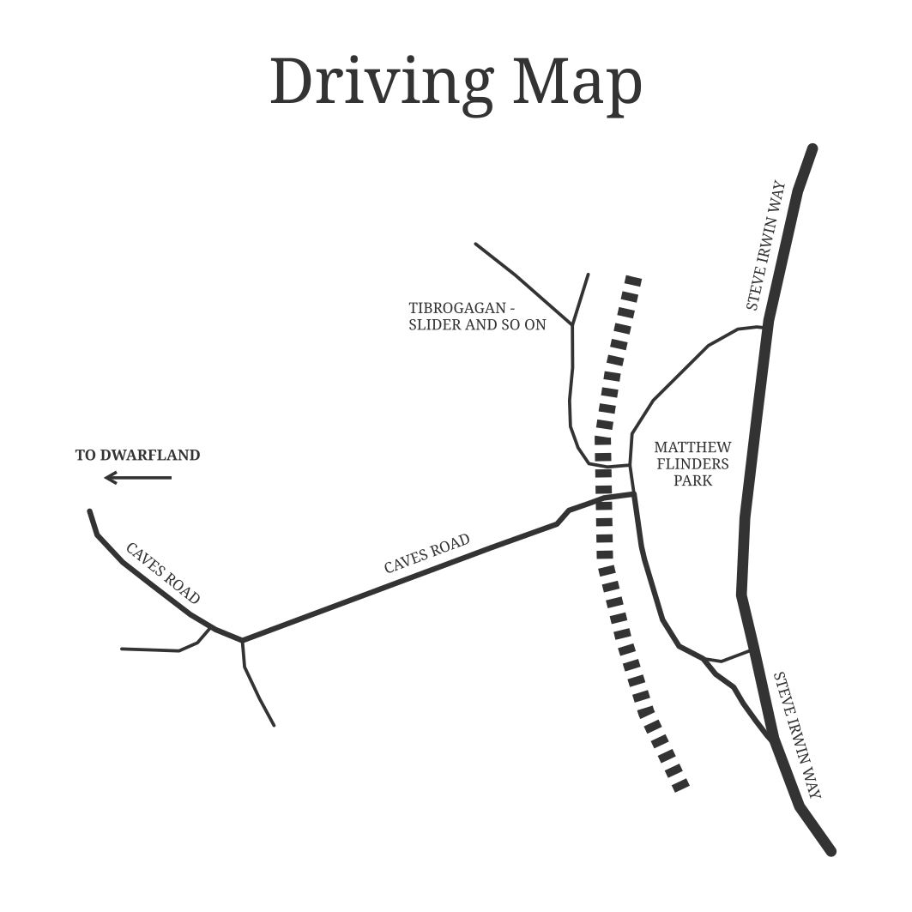
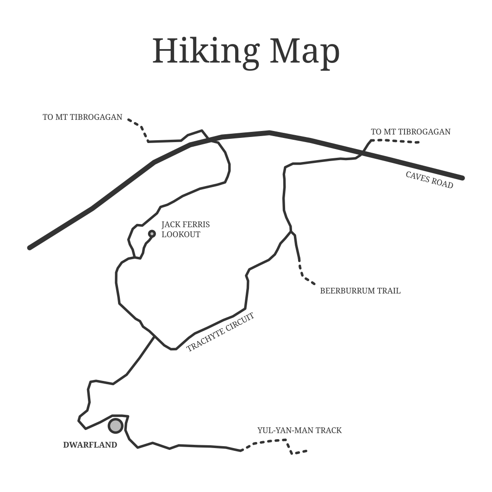

# Dwarfland Topo

Dwarfland is a small crag just near Mt Tibrogagan in Queensland (Australia). 
It's relatively unknown and has nice moderate face climbing with afternoon (1pm) shade. 
The routes tend to be mostly crimpy and take a bit to find the best holds. 
Many of the anchors are set back a bit from the edge, so bring cord if you want to set up top ropes. 

It can be tricky to work out which routes are which at Dwarfland. 
This topo gives a top-down view of the crag. 
Others I've climbed with found it made locating routes a breeze. 

Download a pdf of the topo [here](dwarfland.pdf). 

## Access

Access to Dwarfland is easy, but can be confusing. 
Because it's right next to the more popular Tibrogagan you should ensure everyone you're climbing with known where to (and not to) go!

To get to Dwarfland, drive up the Bruce Highway and turn off onto Steve Irwin Way. 
From this road you want to pull into Matthew Flinders Park. 
This is exactly where you'd go to get to Tibrogagan. 
Take the first turn under the railway onto Caves Road. 
(The second turn is the route to Tibro.)
Follow this road until you reach a gate at the edge of the national park, there should be space to stop here. 

Follow the road until you come across the Trachyte Circuit. 
Take a left along this circuit (heading south) and follow it until you reach the intersection with the Yul-yan-man track. 
Follow the Yul-yan-man track until you reach Dwarfland. 
The cliff is obvious. 

