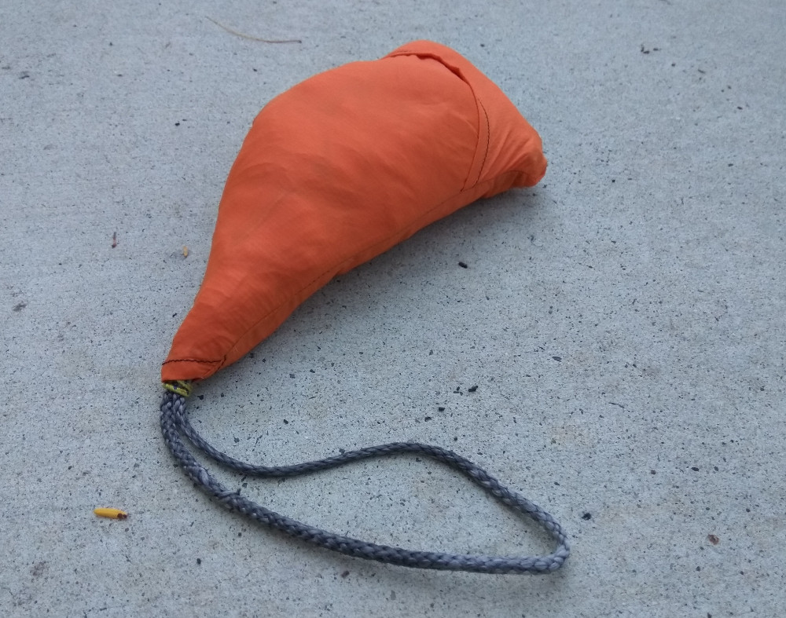
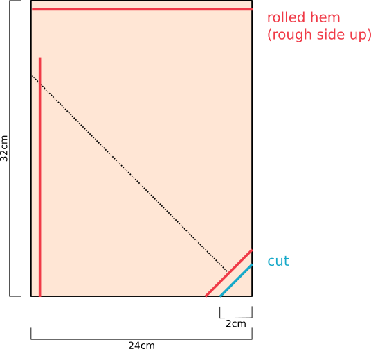
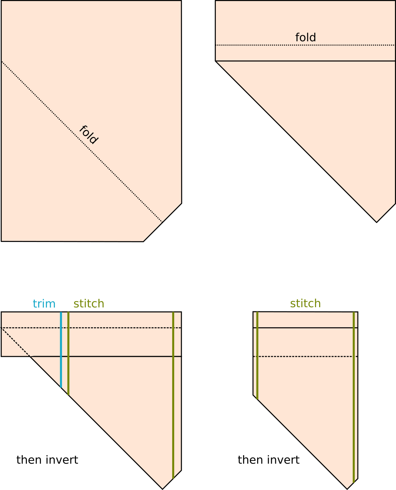

# Hammock Bag

This simple bag is the perfect stuff-sack for hammocks. 
It's ultralight, can't get lost and makes setting up a breeze. 

The basic idea is to modify a pillowcase style stuff-sack to have a hole in the bottom. 
One end of you suspension threads through this hole. 
To set the hammock up, attach the visible end with the hammock still in the bag, then pull it out and tie up the other end. 
No need to worry about dropping your hammock on the wet, muddy ground. 

Start off with a rectangle and hem along the top and left edges. 
You don't need to go right into the shared corner as this will be chopped off later. 
Take the bottom right corner off and hem it too. 
Obviously you'll need to fiddle with the dimensions to fit your hammock. 

Then just follow the pictures. 

