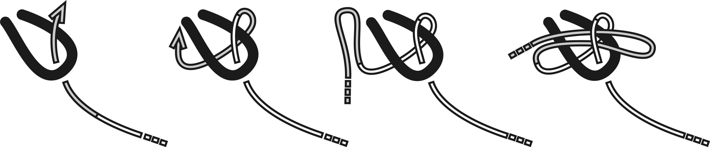
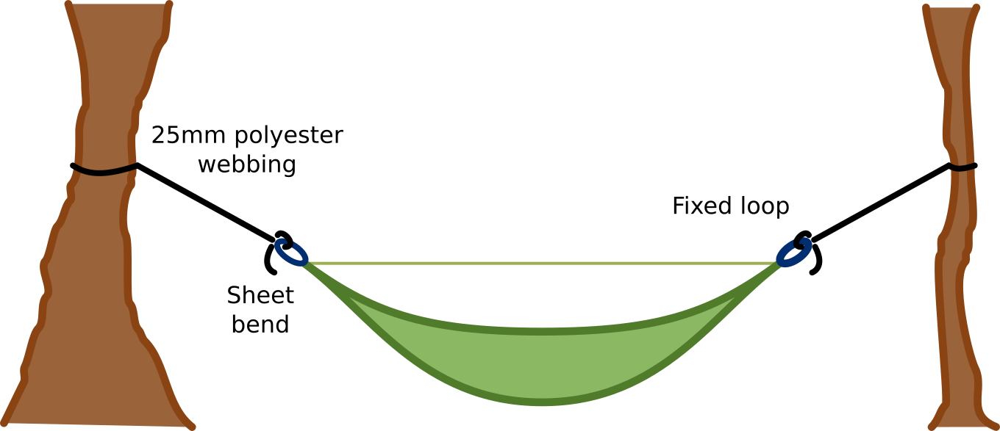
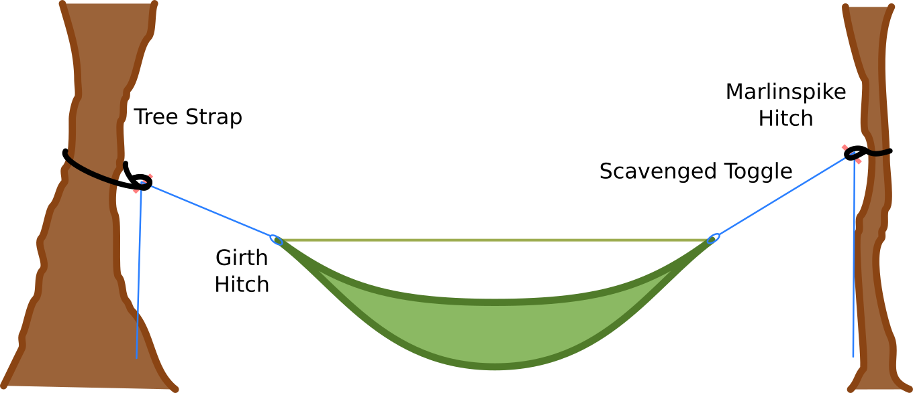
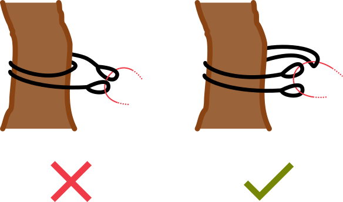
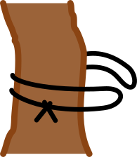

Hammocks themselves are simple, just a rectangle of fabric, but the systems people use to set them up can be anything but.
Take a look around the [Hammock Forums](https://www.hammockforums.net/forum/) and you'll find a million clever ways to suspend a hammock.
I enjoy playing around with these as much as the next guy, but always end up falling back to the simplest option.
Knots.

Knots offer unparalleled versatility with no extra weight penalty.
The only downside is that they can be fiddly.
While it's a common complaint, I don't find this to be the case.
Setting up my hammock is such a tiny fraction of the time I spend on a trip that it's almost insignificant.
Three minutes or five, neither is going to make or break my day.

The king knot for hammock suspension is the sheet bend, or variations thereof.
This simple knot is easy to adjust, holds firm and doesn't lock together into an unravellable mess.
If you squint your eyes a bit, you'll even notice that it's closely related to the famous bowline!
The diagram below demonstrates how to tie a slipped sheet bend.

# Sheet Bend Suspensions

Using the sheet bend we can easily suspend a hammock.
There are essentially two choices of how to do this, either we make the knot at the tree or at the hammock.
Both options are perfectly servicable.

## Knot at the Hammock

This is the simplest option.
Gather your hammock with short loops of cord at either end.
A popular option is to use spliced loops of amsteel here.

At each end of the hammock you'll have long tree straps.
These go around the tree then to the hammock, where they're secured with a sheet bend.

I suggest several options for the long straps.

- ~4m length of webbing with a loop sewn in one end.
- ~1m piece of webbing with loops in either end, girth hitched to a longer length of static rope.
- ~5m length of thin webbing (or mule tape), with the last 2m folded over and sew to make an extra large loop. The doubled part of the webbing then serves as the tree strap.

## Knot at the Tree

Alternatively you can tie the knot at the tree.
This option is more compatable with standard tree straps and avoids using an extra piece of rope to gather the hammock.

Use two large lengths of cord, with eyes spiced or sewn in one end, to gather your hammock.
Place the tree strap as normal and attach the hammock with a sheet bend.

If you're using slippery cord (eg amsteel) the sheet bend may not hold.
In this case you can either add an extra wrap to the bend or use some sort of lashing (c.f. Hennesy Hammocks with figure 8 lashing).

## Lightest Suspension in the World

For the true gram counters out there, sheet bends are probably the lightest possible form of suspension you can find.
At least, I've never seen nor imagined anything lighter.

I have two lengths of dyneema cord with some narrow tree straps which I use in the 'knot at tree' configuration above.
They come in at under 60g for the entire suspension!
Probably you could go even lighter if you used fancy kevlar straps and really dialed in the diameter of your dyneema rope.

# Tree Straps

I've mentioned tree straps a few times while talking about hammock suspension.
Setting up a hammock with just an ordinary rope wrapping around the tree concentrates all your weight on a tiny area of bark.
This is a recipe for disaster!
Instead of using rope, the standard is to use tree straps, short lengths of webbing which wrap around the tree and distribute the forces better.

It's a common refrain: "save the trees".
We should do our own small part whenever we set up our hammocks.

Every camping or adventure store I've been to sells hammock.
Unfortunately, none of them seem to promote tree straps.
Personally I think this is grossly irresponsible.
Shame on them!

One fequent point of contention is how wide the straps should be.
It's a tricky question.
The answer obviously depends on what sort of trees you hang from and how big you are.
25mm straps are the standard recommendation, although you can easily go wider.

### Doubling Up the Strap

Sometimes you'll find a tree that needs a little extra protection.
Maybe it's small or has soft bark.
In these situations it's a good idea to double up the tree strap.

The obvious way to do this is to wrap the strap around twice.
This helps, but I think there's a better way.
With the wrap, there is still a lot of force concentrated on the points where the straps first touch the tree.
A better option is to double the strap completely and join the ends independently.
This divides the force evenly between the two strands.

### No Sew MYOG

Tree straps are very easy to make yourself and pretty cheap otherwise.
That said, sometimes you don't have a sewing machine, don't want to sew, aren't confident in the strength of your stitches, or just can't be bothered.
Luckily it's easy to make tree straps with knots.

Standard straps use loops at each end of the webbing.
If you're using knots this is going to be fairly bulky.
For improvised straps I suggest a different technique.
Create a loop from webbing that is twice as long but half as wide.
This way you'll only use a single knot.
As long as you pass it around the tree correctly it will distribute the forces just as well.

You can form a strong loop in webbing with the water knot.
This 'water knot' is just a variation of the bog standard overhand knot.

