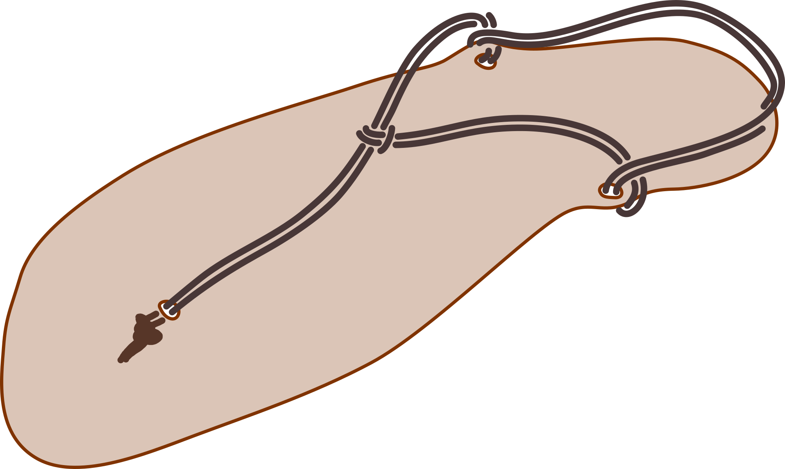
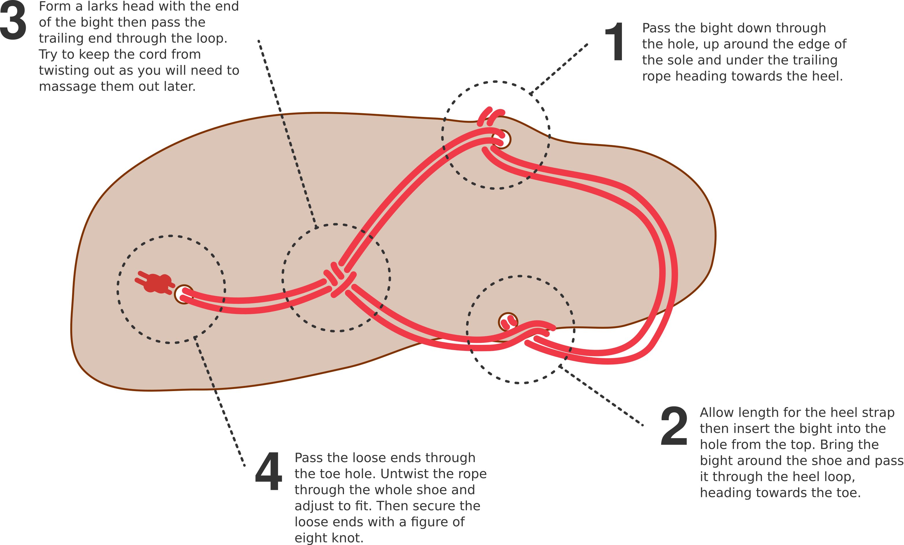

# Hidden Knot Huaraches

Huaraches are awesome, minimal, ultralight and comfy shoes that you can easily make yourself. 
The hardest part of the whole thing is finding a suitably tough piece of rubber to use. 
One option is to just buy a kit from [Xero Shoes](https://xeroshoes.com/). 

There are lots of different ways to tie huaraches. 
You can find a bunch [here](https://xeroshoes.com/tying/). 
My personal favourite is a style I've dubbed the 'hidden knot' because the knots are, well, hidden.
I haven't seen this particular method elsewhere so drew up some simple diagrams. 

The hidden knot is a very slight variation on one of the simplest methods of tying huaraches, called the minimal hitch on Xeroshoes' page. 
Use a thinner cord as we will double thread everything. 

Tying Instructions
==================

We have to tie the knot in an unusual order. 
Start by folding a 1.5m section of cord in half, then thread the bight through the two ankle holes. 
Pretty much any way you do this will work, but take a look at the diagrams if you want to copy exactly what I do. 

Once you've threaded the ankle holes, form a girth hitch in the bight of the cord and thread the loose ends through. 
Push these loose ends down the toe hole. 

At this stage you will want to massage the rope to get any twists out of it so that the rope sits flat on your feet. 
Adjust the fit of the huarache by starting at the larks head and pulling the rope tight through the series of knots. 

To finish off the shoe, tie the loose ends into a figure-of-eight underneath the shoe. 
Try to orientate the knot forwards so that it doesn't lump under the ball of your foot. 
Cut the ends just below the knot and use a flame to melt, flatten and secure it. 

If you don't know or remember the figure-of-eight and girth hitch, you should be able to work them out from the simple diagrams below. 

Since this tying method can't be adjusted after you have melted the knot, I'd suggest you use it only after wearing huaraches for a while. 
The hidden knot is the most minimalistic and stylish way to tie these shoes, but obviously I'm biased!
