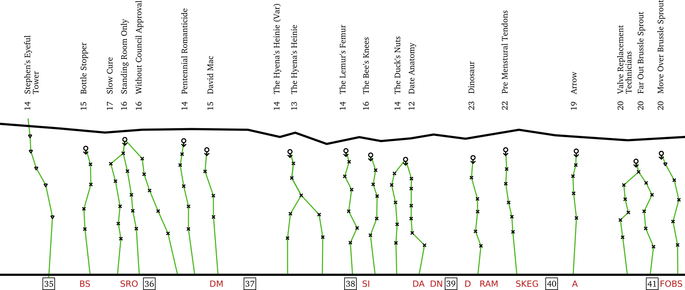

> More complete information about this map can be found [here](https://tojahech.github.io/kangaroo-point/).

A simple map showing sport climbing routes at the Kangaroo Point Cliffs in Brisbane, Australia.
With just the essential information printed on a single sheet of paper, this concise and convenient map is easy to use while actually climbing.
Feel free to download and print a copy for yourself or your friends.

Detailed information about all the climbs at the cliffs can be found on [The Crag](https://www.thecrag.com/climbing/australia/kangaroo-point) or in the South East Queensland Guidebook.
My map is certainly not a replacement for these great resources, but instead a quick reference to make life easier for people who visit KP.

- [Download Map (PDF)](https://raw.githubusercontent.com/tojahech/kangaroo-point/master/output/Kangaroo%20Point%20Map.pdf)
- [Download Tick-List (PDF)](https://raw.githubusercontent.com/tojahech/kangaroo-point/master/output/Kangaroo%20Point%20Ticklist.pdf)

If you have any suggestions or corrections, send me an email or submit a patch on [Github](https://github.com/tojahech/kangaroo-point).
