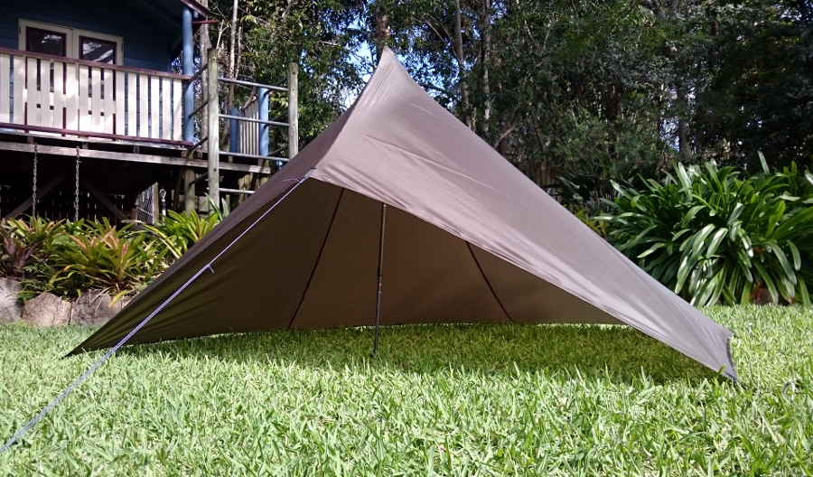
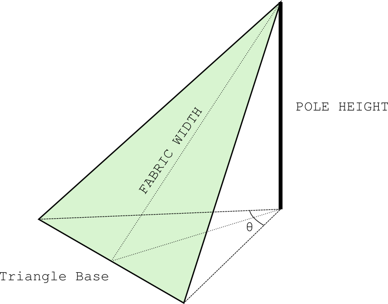
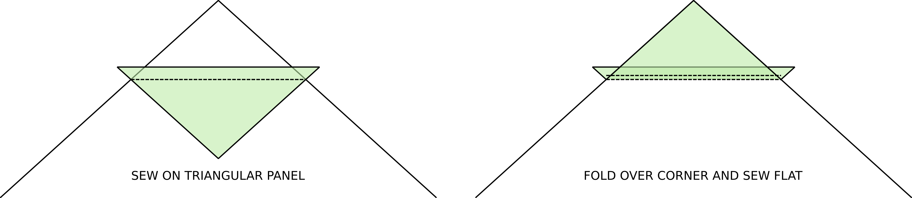

# MYOG Pyramid Tent

Pyramid tents are popular amongst ultralight hikers, but almost completely unknown outside of that community. 
They are easy to set up, resistant to wind, great in the rain and weigh very little. 
As a niche market ultralight hikers often don't get to take advantage of the same economies of scale you see everywhere else and so making your own gear is particularly attractive. 
This simple design is easy to sew and doesn't waste any fabric. 
A perfect project. 

My particular version of this tent uses a 110cm hiking pole and is make from 0.9 Xenon Sil. 
The fabric is waterproof, lightweight and low stretch. 
Without pegs or poles my tent weighs a back-breaking 140g and I've comfortably used it in tropical storms and dreary drizzles. 

This page is mostly about the design of the tent, I'll leave the details of the sewing up to you. 
That said, I have listed some handy tips and gotchas down [below](#assembly-tips). 

Pattern
=======

This shelter design has two main components, a pyramid section at the rear which forms the sleeping area and an awning over the entrance. 
By leaving the entrance open, we can reduce condensation while still protecting ourselves from the elements. 
Pegs are required for each corner of the pyramid as well as to pull the awning taught with a short rope. 

The pattern for this tent is deliberately simple, allowing the design to be cut from a bolt of fabric with little wastage. 
Triangular panels alternate across the width of the fabric with the first and last triangles remaining connected to the ends of the fabric. 
These additional flaps are joined to form the awning. 

In my personal tarp I used just over 3m of fabric. 
It's important to note that the fabric I used had no observable 'inside' and 'outside' so I was able to flip the panels freely. 
If you use a coated fabric then you need an odd number of triangles in the pyramid to ensure the whole surface is orientated correctly. 
My tarp was designed to match my 110cm hiking poles and to use the entire 148cm width of fabric. 
It's very easy to modify the design for your own needs and I've thrown together a simple calculator [below](#calcInputs) to help you fiddle. 

Customisation
=============

Depending on the exact gear and fabric you use, you might want to adjust the design. 
As drawn, the shape of the tent depends on several parameters; the height of your trekking pole, the width of your fabric, how wide you want the base of the triangular panes to be and how many panels to use. 
Generally narrower panels will be more taught but will require you to carry more stakes. 
Laying the panels out in this manner does restrict the maximum size of the tent. 
If you're particularly tall you may want to seek out some extra wide fabric to use. 

Each individual panel in the tent covers a certain arc around the vertical pole. 
I chose to cover approximately two thirds (240°) of the area with the panels and leave the rest for the awning . 
This gives an area for sleep as well as some space for my pack, shoes and other gear. 

<form id="calcInputs">
  
Pole Height: <input class="calcInput" id="inputPole" type=text value="1100">

  
Fabric Width: <input class="calcInput" id="inputFabric" type=text value="1480">

  
Panel Base: <input class="calcInput" id="inputBase" type=text value="1160">

  
Number of Panels: <input class="calcInput" id="inputN" type=text value="4">

</form>

With those parameters, the panels each span x degrees with a total angle of y degrees. 
Below is a top-down view of what the tent would look like. 

<canvas id="tentNet" width="600" height="600"></canvas>

Assembly Tips
=============

Joining the panels into the completed tent should be fairly self-explanatory. 
Use your favourite sewing techniques. 
I don't claim to be a wiz with a sewing machine, but here are a few tips to help out. 

- When marking out the pattern, square off the fabric and take all measurements from one end. 
  This helps avoid compounding small errors throughout the design. 
  If you measure each panel individually, a millimeter of slip here and there might add up to a rather wonky last panel!

- Join the panels together with a single straight stitch, then erect the tent to determine the rest of the details experimentally. 

    - Work out where to join the awning pieces by eye. 
    You could calculate this, but it's much easier to just test it and you'll also avoid getting caught out by stretchy fabric. 

    - To make the tent more taught and eliminate floppy fabric in the middle of the ridge lines, it's a good idea to sew the panels together with a curved seam. 
    Again, you could try to calculate the optimal solution, but it's better to set the tent up with straight seams and estimate how much of a curve to put in. 
    Google for a 'caternary curve calculator' to help you draw out the curve once you've determined how much to bring the seams in. 
    Sew the curved seam along the straight stitches and trim afterwards. 

- I like to finish off my seams with a pseudo felled hem. 
  That is, join the fabric with a single row of stitches, then roll the seam allowance and sew it flat. 
  This give a visually appealing finish that's also water resistant. 
  If you sew this way you will be working inside out, so don't forget to flip you panels. 

- Create the tie-out points with webbing. 
  It's handy to tie a small loop of thin shock cord to the webbing to help pull the tent taught when setting it up. 

- If you want to add reinforcement patches to the corners and peak of the pyramid, do so before joining any of the panels. 
  Sew a triangle of fabric into the corners of each panel and invert it before joining the panels. 
  In my humble opinion these aren't actually necessary, but better safe than sorry. 
  

Asymmetric Panels
=================

I chose to make all the panels in my pyramid tent the same size. 
This make life easy but is not 100% necessary. 
Fiddling around with asymmetric panels may eek out a little more room in one direction, at the cost of a less stable geometry. 

The diagonals across the fabric can be different so long as they have a partner to match with. 
Make sure to make a model with paper to check it all matches up before you cut your fabric!

