A collection of my favourite logic puzzles.
Some of them are here because they're fiendishly difficult, others because the solution is in some sense 'cute'.
Hover to see the solutions.

## Simple and Cute

### Cutting Wood (Very Easy)

A lumberjack lives in a forest cutting logs with an axe.
It takes him six minutes to chop a log into three pieces.
How long would it take him to cut a log into five pieces?

### Solution

The obvious answer is ten minutes.
Six minutes for three pieces means each piece takes two minutes.
Multiply it out and five pieces will take ten minutes.
Easy peasy, but wrong!

Think instead about the process of chopping up a log.
It's not the pieces that take time, but the cuts.
Cutting a log into three pieces requires you to make two cuts.
So our forester needs three minutes for each cut with a total of twelve minutes.

Of course, as with any riddle, it's easy to argue with the hypothetical but once it's pointed out the answer should be obviously correct.

### Dynamite Fuse (Easy)

You are given two ropes, dosed in kerosene.
One rope takes three minutes to burn end to end and the other four.
Unfortunately they are fairly ragged and don't burn at a steady pace.
For example, half the rope wouldn't necessarily burn in half the time.
How could you use these two ropes to time out five minutes?

### Solution

_This is a wonderful variation on the classic puzzles about filling water bottles of various sizes.
That said it's not really about the maths, but rather the physical situation.
The solution requires you to think outside of the box and combine your tools in an interesting way._

Instead of jumping straight to the solution, here are two easier problems that will get you a long way towards the answer.

- With the same two ropes as in the original problem, how do you measure seven minutes?
- With just a single rope which burns in two minutes, how do you measure one minute?

Adding the times is simple, just burn one rope then the other.
Halving the time is a little more complicated.
Because the ropes don't burn evenly, you can't cut the rope in half or fold it or wait until the flame reaches halfway.
You can however light both ends of the rope simultaneously.
When the two flames meet (not necessarily in the center) exactly one minute will have elapsed.

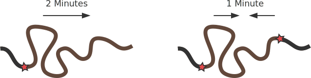

Now the final solution is straightforward.
Light the four minute rope at both ends simultaneously.
When the flames meet, light the three minute rope.
After that has burnt through five minutes will have elapsed.

## Visual Puzzles

### Four Lines (Easy)

Connect nine dots in a three by three grid with four straight lines, drawn end to end without taking your pen from the page.

### Solution

_This one is a classic although rather simple.
I like to pretend that this puzzle is where the expression 'think outside the box' comes from._

The trick is to draw the lines beyond the grid.

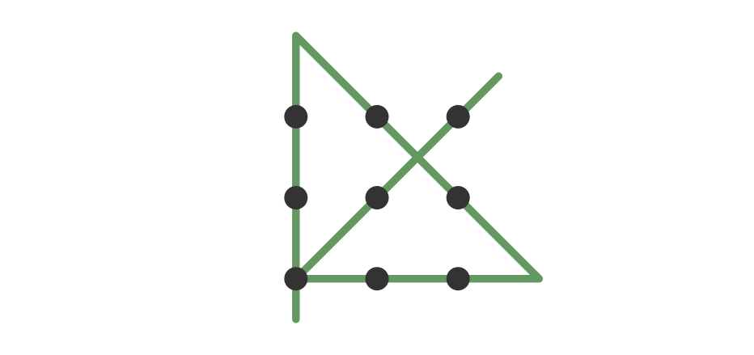

### Cubical Astronaut (Easy)

An astronaut has landed her spaceship on one corner of a strange cube-shaped moon.
She has explored to the opposite corner but is beginning to run out of oxygen and needs to get back to the shuttle as quickly as possible.
What path should she take?

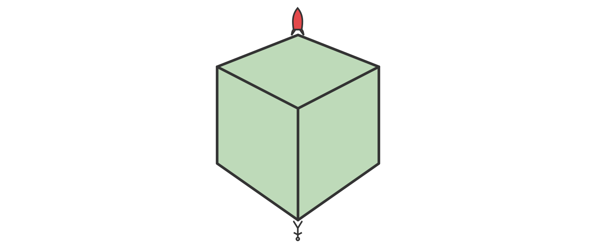

### Solution

_These sort of geometric problems are very easy in hindsight.
Once you know the solution it's obvious, but when you don't..._

The shortest path between any two points is a straight line.
You might imagine this line looks a little like in the picture below.

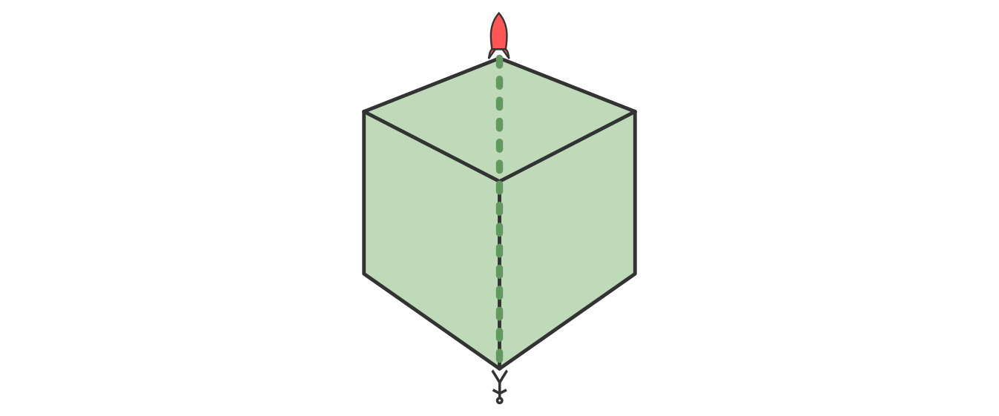

However the 'straight' line doesn't go exactly where you'd think.
We have to keep in mind that we're dealing with a 3D object.
Flatten the box into a net and then draw your straight line.

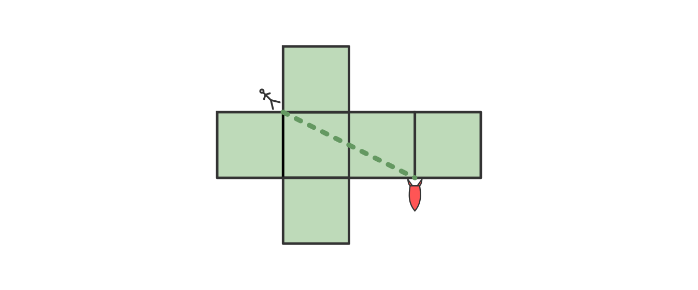

When you convert that back to the cube you find it gives a slightly unintuitive path across the surface of the moon.

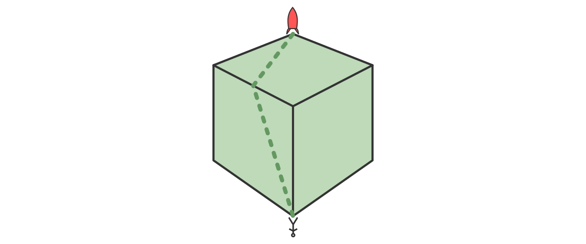

### Bucketing (Easy)

A boy is standing in a field with a bucket.
Nearby is a (dead straight) river and further away his home.
He needs to walk down to the river and fill the bucket then walk home.
What's the shortest path he can take to do so?

### Solution

We can use a simple geometric trick to find the shortest path to the river and back.
Again, the shortest path will be a straight line, but which one?
You could use some maths and solve it as an optimisation problem, but there's no need.
Treat the river as a mirror and reflect the position of the house.
The shortest path to the reflected house is a straight line through the river, reflect this back to solve our problem!

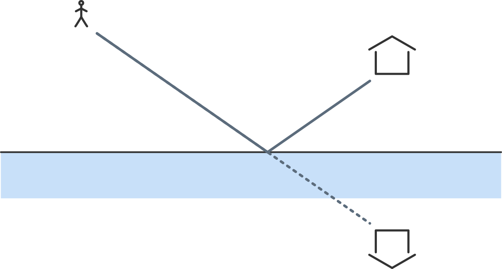

### Division (Medium)

Cut the following shape into two identical pieces.
You don't have to follow the grid, it's just there to help visualise the area.

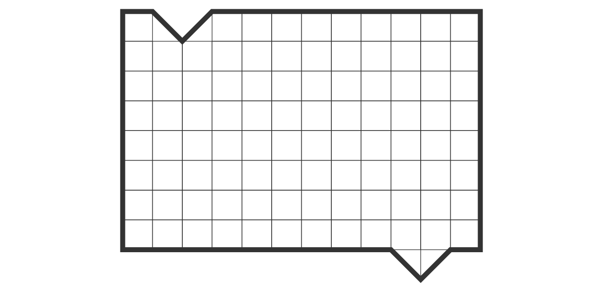

### Solution

The difficulty of this puzzle is working out how to match the concave and convex notches.
Any cut is going to create a new notch of each type.
Eventually you'll realise the only way it's possible is if one piece is flipped upside down after the cut.
It may help to solve a slightly simpler version of the puzzle first.

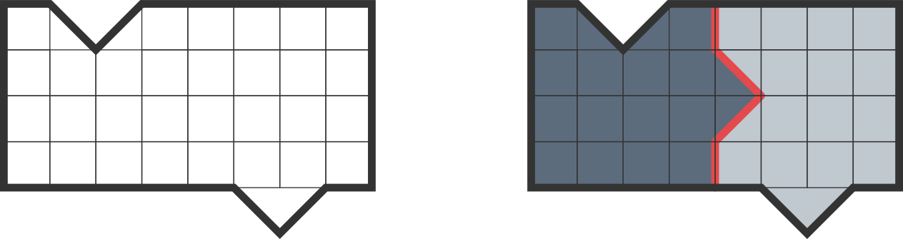

After that the answer to the original should come quickly.

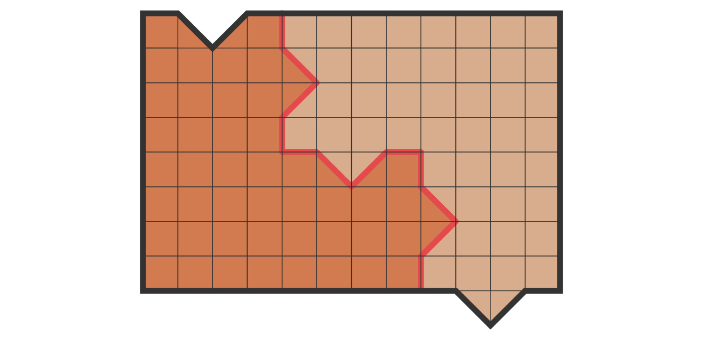

## Unintuition

These puzzles are great because it's easy to get stuck thinking about them in the 'wrong way'.

### Chasm Crossing (Medium)

Four people are exploring a cave and hear a distant rockfall heading their way.
To escape they must cross a precarious bridge over a nearby chasm.
They only have half an hour before the cave-in will reach them.
The four cavers are of various levels of fitness and would respectively require 2,5,11 and 13 minutes to cross the pit, although they have the endurance to cross back and forth as many times as needed.
Unfortunately the bridge is rather old and will only hold the weight of two people at a time.
Even worse, the cavers only have a single torch which they need to use while crossing the bridge.
Can they make it?

### Solution

The intuitive answer is to use the fastest explorer to run the torch over and back but this takes 33 minutes.
Once you notice the obvious approach it's rather tricky to get your mind thinking through other ideas.

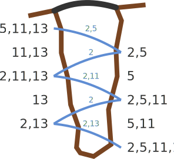

The trick is not to think about being quick, but instead to try and not waste time.
It's the two slowest cavers who delay the process the most.
If you make sure to send the two slowest people across the bridge together then they will actually waste less time overall.

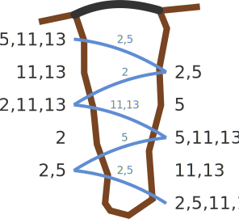

### Coin Picking

Let's play a game.
First I set a row of coins of varying values on a table in front of us.
We each take turns picking a coin from either end of the row.
There are an even number of coins so we both end up with the same number of coins, although we may not get the same total value.

If I let you go first, is there a way you can guarantee to get at least as much money as I do?

### Solution

This is quite a fun puzzle.
It's easy to generate ideas for potential algorithms that might maximise the value you get.
Generating nasty cases where an algorithm fails is also rather fun.

There's a simple trick that does work.
Divide the row of coins into two groups, even and odd positions along the row.
Count up the value of each group and then take the end coin from the group with the largest value.
Now your opponent is forced to take a coin from the other group.
At each step if you take an odd coin, then your opponent will have to take an even (or the other way around).

## Fiendish Puzzles

### Circular Road (Hard)

_This is my absolute favourite puzzle.
Fair warning, it's difficult!_

In a desert there is a long loop of road with several petrol stations scattered along its length.
You have a car standing by, and distributed amongst the petrol stations and the car's tank is exactly enough petrol to drive once around the entire road.
Is there a point on the road where you can start driving and complete the entire circle without running out of petrol?
(Assuming filling up the car doesn't waste any fuel, you don't crash, the world is perfect, blah, blah.)

### Solution

Given the way that this question is worded, the answer is obviously yes.
The real trick here is to give a compelling reason why.
I actually have two completely different solutions to the puzzle.
One solution is algebraic and the other is analytic.

First note that we can simplify the problem a little.
Instead of looking at any place on the road to start, we can just consider starting at the petrol stations.
We can also ignore the fuel in the car and imagine it has been redistributed amongst the petrol stations.
Both of these simplifications make the problem less general, we won't find all solutions like this but if we can solve the restricted problem we'll also have a solution for the original.

**Inductive Solution**

One way to solve the problem is to use recursion (or induction if you'd like to write out a formal proof).

At each petrol station write down the distance to the next station and the distance you can drive with the petrol at that station.
If none of the petrol station had enough petrol to get to the next station then there wouldn't be enough petrol overall.
So (at least) one of the stations has enough fuel to reach the next station.
We can then mentally combine these two stations and imagine that the first station also has the petrol from the second.
This reduces our problem to one with one fewer stations.
A starting point that works in the reduced problem will also work for the original.

We can do this process again and again until there is just one station left.
This station has all the fuel to get around the road and so we can start here.

**Analytic Solution**

For a different solution to the problem, let's try to graph the petrol consumption along the road.

Pick anywhere on the road and imagine that you drive the car around the loop.
As you drive keep track of the amount of fuel in the tank.
Now you will probably have picked a bad spot to start and won't get very far before running out of gas.
That's ok, we're just imagining the drive to begin with.
Keep going all the way around using negative numbers to record the fuel consumption.

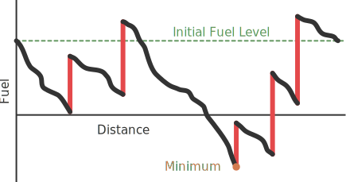

Because there is exactly the right amount of fuel along the track, when you get back to your starting point the fuel tank will once again be empty.
Look at a graph of the fuel in the tank over the entire course and choose any one of the minima.
Starting at one of these points makes that minimal value your new 'zero' and so you can guarantee that you'll always have fuel in the tank for the whole drive.

### My Number is 25 (Hard)

Alice, Bob and Carrol are sitting in a circle with positive whole numbers drawn on their foreheads.
They can each see the other's numbers but cannot see their own.
Additionally, they know that two of the numbers add up to the third but not which number is which.
You observe the following strange conversation,

- **Alice:** I don't know my number.
- **Bob:** I don't know my number.
- **Carrol**: I don't know my number.
- **Alice**: My number is 25.

What were the other two numbers?

### Solution

This is an awesome puzzle, but unfortunately I think it might be imposssible!
There are two subtly different ways you can interpret the question "what were the other two numbers?"
We can either ask "what could the other two numbers be?" or "what must the other two numbers be?"
Existence and uniqueness essentially.

The second of these is much harder to answer.
In fact I don't have a solution for it and I suspect one may not exist.
Look around the internet and you can find variations of this problem, often with accompanying solution.
Each of the ones that I found falls into the same subtle trap.
If you manage to figure out a true solution, please let me know.

**Existence**

First off, let's look at one option for what the numbers could be.
If Bob's nuber is 10 and Carrol's number is 15 then the conversation makes sense.
You can find these numbers either by guessing or with some algebra but for now we'll just verify that they work.
Let's start by looking at what the three people determine about their numbers at each stage of the conversation.
Write A, B and C for the numbers of Alice, Bob and Carrol.

1. Alice says she doesn't know her number.
   If B and C were the same then their difference would be zero.
   That isn't a positive number so in that case Alice would know that her number was the sum of B and C.
   Since she doesn't we can infer that B ≠ C.

2. Bob reasons in the same way as Alice so we know A ≠ C.

3. Again, for the same reason we know A ≠ B.
   Indeed all the numbers are different and at this stage Carrol knows this.
   There is another way in which Carrol might know her number.
   If one of the numbers she sees is twice the other, then the difference would be the same as the smallest number.
   Since all the numbers are different Carrol could then conclude that her number was the sum.
   This doesn't happen so we must also have A ≠ 2B and B ≠ 2A.

4. On Alice's second turn she (along with us) knows that A ≠ B ≠ C, A ≠ 2B and B ≠ 2A.
   If B = 10 and C = 15 then Alice knows she isn't the difference as that would contradict B ≠ 2A.
   So Alice's number must be the sum and so she knows her number.

**Uniqueness**

What about the second question, we know 10 and 15 work, but are they the only such numbers?
We could take the approach above a little further and work through all the cases algebraically.
What you'll find is that most of them give some sort of contradiction, either they imply one of the numbers is negative or give an equation which doesn't divide into 25.
There is only one case which doesn't cause a contradiction and it solves to 10 and 15, indeed this is how I found the number in the first place.

Unfortunately this whole approach is fundamentally misguided.
It rests upon a subtle assumption about the problem which we cannot make.
In dividing the solution up into a list of cases like this, we're assuming that Alice's sudden knowledge of her number must come from one of the pieces of information we've derived.
We have no way of knowing that we've spotted everything, indeed there are at least a few other bits of info you can derive about the numbers I didn't bother to include above.
Alice may well have worked out her number using some logic we haven't even considered.

I hope that there's a way to approach the problem directly which doesn't fall prey to this tacit assumption, but I'm leaning towards it being impossible.
