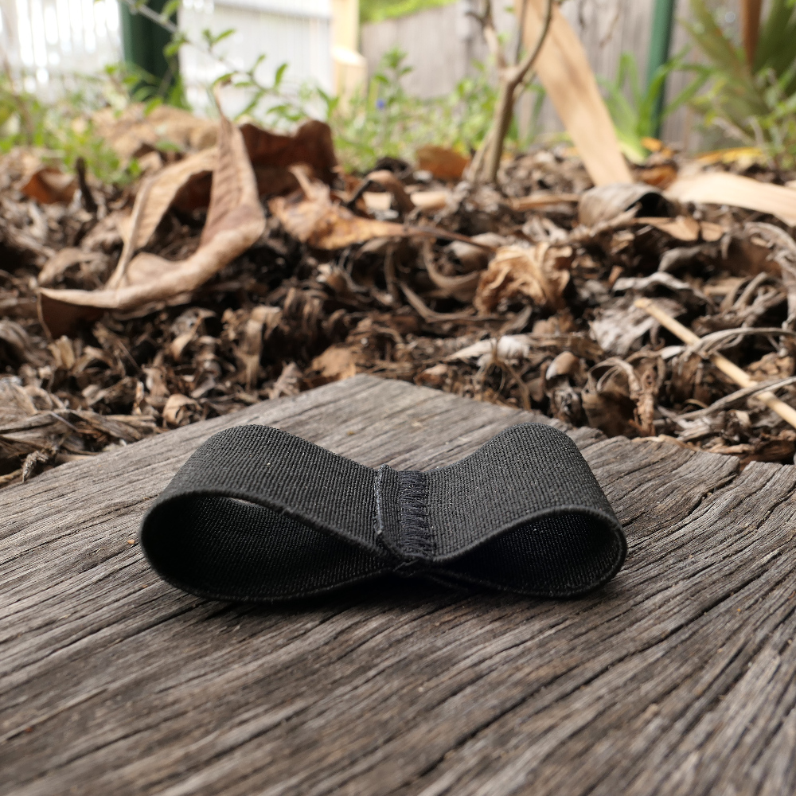

The infinity clip is the best thing since sliced bread.
It's ridiculously handy, weighs next to nothing and can be left in the bottom of your pack until you need it.
In reality, it's a piece of scrap elastic sewn into a loop.

In my experience, stick clipping is something you do every once in a while.
Maybe you'll come across a climb with a crazy high first bolt or a sketchy landing.
When this happens you want an easy way to clip the bolt.

There are tons of commercial stick clips out there.
They tend to have fancy retractable carbon fibre poles with intricately designed claws at the end.
Personally, I'm not a huge fan.
They're crazy expensive and even if they weren't, it's another thing to lug around.

Think of the infinity clip as an alternative to the forked twig trick.
(If you haven't seen that trick before I'll describe it at the bottom of this page.)

## What is the infinity clip?

The infinity clip is a short piece of wide elastic folded to create two loops.
It lets you attach your quick draw to the end of a scavenged stick to reach up and clip the first bolt.
You can make one in less than five minutes and it'll probably cost you less than a dollar.

## How do you use the infinity clip?

To clip a bolt with the infinity clip, find a stick in the bush.
Loop the elastic around the stick using whichever loop is the appropriate size.
Pull the loop open with the other side and insert your quickdraw.
Insert the base of the quickdraw so that the spine and gate are held by the elastic.
Make sure you pull the dogbone up the side of the spine so it doesn't get caught.

Make sure you've attached the rope before trying to stick clip!
Reach up with your stick, insert the draw through the bolt and pull on the stick and rope to release.

<video controls>
<source src="demonstration.mp4" type="video/mp4">
</video>

## Making an infinity clip

To make your own infinity clip cut a 16.5cm piece of elastic.
You want a strong wide elastic, the stuff I use is 4cm.
Fold the elastic into a z shape with a 5cm loop on one side and a 4cm loop on the other.
Sew a bar tack down the center of the area where the three layers of elastic meet.
You can do this with a standard zig-zag stitch, just go back and forth a few times.

## What's the forked twig trick?

The 'forked twig trick' is an excellent way to stick clip if you don't have any gear with your.
In case anyone hasn't seen this before, here's how it goes.

Find a small twig with a fork or lump in one end.
Snap the twig so it's the perfect length to prop open the carabiner.
Clip your rope into the other end of the carabiner and loop the dogbone over a long stick.
Lift the whole apparatus up and use it to clip.

> PICTURES
