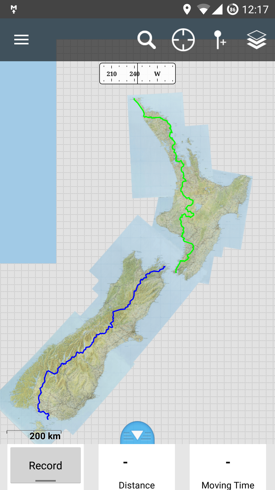

Te Araroa is a long hiking trail in New Zealand that spans the entire country.
On their official website, the [Te Araroa Trust](http://teararoa.org.nz/) publishes several GPS files with waypoints along the entire track.

I had a little trouble using these files as the track was divided up into many many small sections.
This stressed out my phone to the point that using the GPS was frustratingly slow.
As a quick fix, I modified the gps file by removing everything except the coordinates themselves.
The results were great, the file size reduced to about 10% of the original and my phone then ran without a hitch.

In case anyone else is running into similar issues, here are the minimised GPS files.

- [Te Araroa GPS (Both Islands)](minimised-TA.gpx)
- [Te Araroa GPS (North Island Only)](minimised-TA-North.gpx)
- [Te Araroa GPS (South Island Only)](minimised-TA-South.gpx)

I imported these into [GaiaGPS](https://www.gaiagps.com/).
This app has a handy 'download map along track' feature which helped me nab detailed topographic maps along the entire trail.

