Climb outdoors enough and eventually someone's going to ask you to teach them to lead.
I love to guide people through their first lead climb so I've put a fair bit of thought into the best way to go about it.
Lead climbing involves a ton of little details that can easily overwhelm a beginner if you dump everything on them at once.
So don't do that!
Instead, introduce things gradually and have your partner practice each new technique as they go.

Depending on how adventurous your partner is, they may not want to dive right into leading after learning the technique.
For these people I like to use 'dummy leading'.
That is, climbing on top rope with a second dummy rope hanging from the harness you can preted to lead with.
As you explain each concept get them to climb (some of) the route and put the concept immediately into practice.
This will help the idea stick.
Another big benefit is that when it comes time to finally lead the route for real they will have climbed it half a dozen times already.

The important things to explain are:

- What a quickdraw is,
- How to rack gear on your harness,
- How to clip the draw to the bolts,
- How to clip the rope through the draw,
- Avoiding back-clipping,
- Avoiding z-clipping,
- Avoiding tangling your feet in the rope,
- Falling safely.

Typically the people I've shown how to lead have climbed a fair bit on top rope and belayed others while they lead.
They have a rough idea of how the whole shebang works, but need to learn the specifics.
You'll have to tailor your advice to whatever specific situation you're in, but hopefully this provides a decent starting point.
(Obviously this information isn't sufficient for climbing trad, although it's certainly necessary!)

## Dummy Leading

Dummy leading is an excellent way to practice the techniques of lead climbing without having to face the consequences of a mistake while still learning.
The idea is to secure the climber with a top rope while they trail a second strand of rope to 'pretend' to lead with.
I'll give you three ways to set up a dummy lead.
Which one you use is up to you.

1. Use a second piece of rope.
   If you happen to have a second length of rope handy you can use this for the dummy lead line.
   Simply tie each rope to your harness as usual.
   Since we aren't actually weighing the dummy rope, it's fine to use thinner accessory cord.
   You'll want the dummy line to be at least 4m long.

2. Tie an eight with a super long tail.
   If you don't have a second rope, this is a simple way to create the dummy line.
   Tie in to the top rope as normal but leave an extra extra long tail on your knot.
   This is bulletproof, but it can be a bit of a pain to rethread the knot with such a long tail.

3. Tie in at a bight.
   We can make things easier for ourselves by tying the knot further along the rope.
   Put a figure eight on a bight four metres from the end of the rope and clip it to the climber's harness with a pair of carabiners.

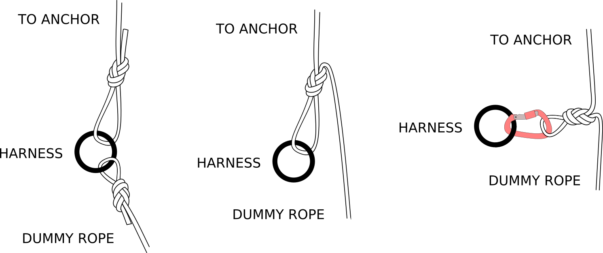

## Nitty Gritty Details

### Anatomy of a Quick Draw

The basic tool for lead climbing is the quickdraw.
Quickdraws are made from two carabiners connected by a short section of webbing.
Most draws are pretty much the same, with some variations on the theme.

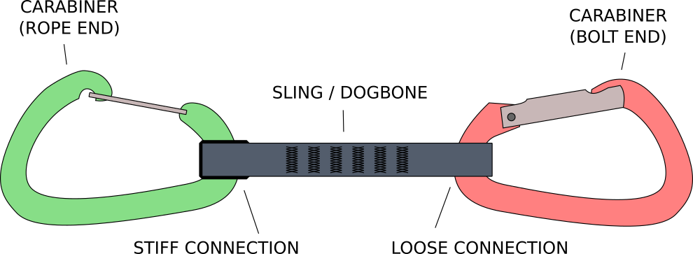

Each end of the quickdraw has a specific purpose.
One always attaches to the bolt and the other to the rope.
Most pre-made draws will have an obvious way to tell the ends apart.
Maybe the carabiners are different colours, or one is a wire gate and the other a solid gate.

The carabiner that clips to the wall will always be attached loosely to the middle sling.
This is to prevent the carabiner from twisting against the rock and levering into a mechanically disadvantaged position.
Usually the rope end of the draw will be held stiffly to the webbing with some sort of rubber clamp.
This keeps the entire assembly more stable and makes it easier to clip the rope while you're climbing.

Quickdraws can be assembled with both carabiners facing the same direction or in opposite directions.
Which one you use boils down to personal preference.
That said, the vast majority of manufacturers and climbers have the gates on the same side.

### Racking Draws

Before you start lead climbing you'll need to hang a handful of quickdraws from your harness.
You always want to attach the loose 'bolt end' of the quickdraw to your gear loops.
That way you can grab the quickdraw and move it from your harness to the rock face in one movement.

Some people prefer to rack quickdraws with the gates facing their body and some with the gates facing outwards.
It's mostly just personal preference.
The draws will sit a little flatter with the gate facing out but many find the arm movement more ergonomic with the gate facing in.
For now do whatever your climbing partner does, but later on you may want to experiment.

### Hanging Quickdraws on the Wall

As you climb up a route you'll need to attach the quickdraws to bolts on the wall.
Make sure that you clip the loose end of the quickdraw to the cliff.
This should happen naturally if you hang them from your harness the right way around.

There is one small detail to think about when you're hanging the draws.
Climbing routes don't always go completely vertical, sometimes you'll veer to the left or right.
As you continue climbing it's going to be better if the rope is dragging along the spine of the carabiner instead of the gate.

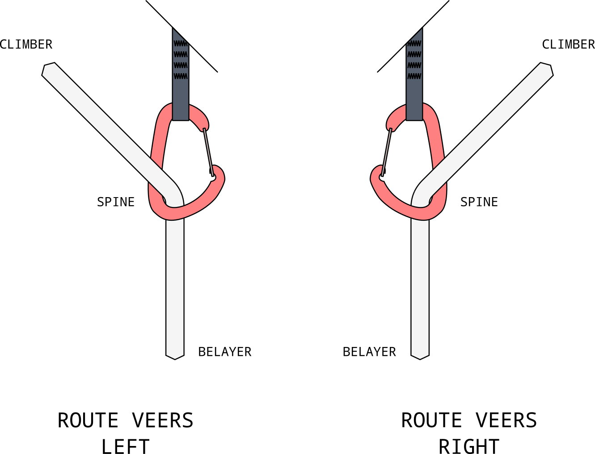

To decide in which direction you want to hang the quickdraw, think about where the route will take you as you continue to climb.
If the route veers to the left you'll want to hang the draw so that the spine of the carabiner is on the left and vice-versa for the right.
Both orientations are fine when the route goes straight up.
As a guide you can often just look for the next bolt and see whether it's to the left or right of your current position.

This is a relatively minor detail that's worth getting right whenever you can.
If you find you've hung a draw in the 'wrong' direction, don't stress about it too much.

### Clipping the Rope

After hanging a quickdraw on the wall you'll need to clip the rope to the draw.
Clipping technique is one of those things that will take a bit of practice to get down pat.
Watch some videos of pro climbers and you'll see that they clip quickly and effortlessly.
This helps conserve energy as you climb.
For now just clip however you can, but later on I'd suggest sitting down with a quickdraw, rope and a few Youtube videos to practice clipping smoothly.

There are a couple of gotchas for clipping that are important to avoid.
These are back clipping and z-clipping.
Both are serious mistakes that can ruin your day.

### Back Clipping

Learning to avoid back clipping is one of the most important parts of leading.
It's one of those mistakes that's easy to spot in a vacuum but a little less clear when you're actually climbing.
A back clipped draw can twist as you continue climbing and sometimes even cause the rope to unclip itself.
Yikes!

What is the correct way to clip the rope to the draw?
I'll offer you two ways to visualise it.

First off, imagine you've continued climbing past a bolt and the rope is pulling the quickdraw away from the wall.
A correctly clipped rope will come up from your belayer, through the draw and then continue up to your harness.
If you back clip, the rope will either twist the quickdraw or go over the draw, back down through the carabiner and up again to you.
This 's' shape is what can cause the rope to unclip.

If the draws are being pulled out from the wall it's pretty obvious how the rope should pass through the carabiner.
When you're actually climbing the draw will be hanging down from the bolt and often dangling against the rock.
We still need to know the correct way to clip.
As you face the draw, you want the rope to emerge from your harness, pass through the quickdraw towards the rock and then head down to your belayer.

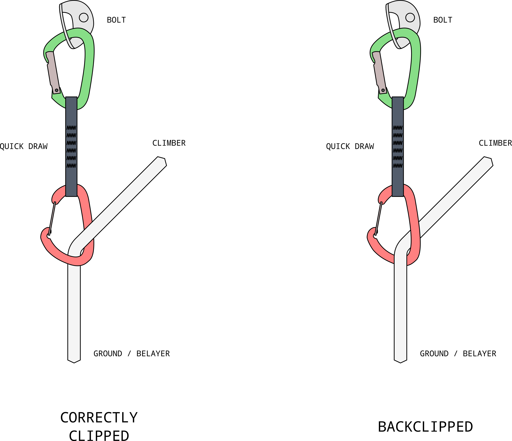

Imagine that there are arrows along your rope emerging from your harness and heading down to the belayer.
When the rope is correctly clipped, these arrows will be pointing through the carabiner towards the cliff.
If the arrows go the other way then your rope is back clipped.

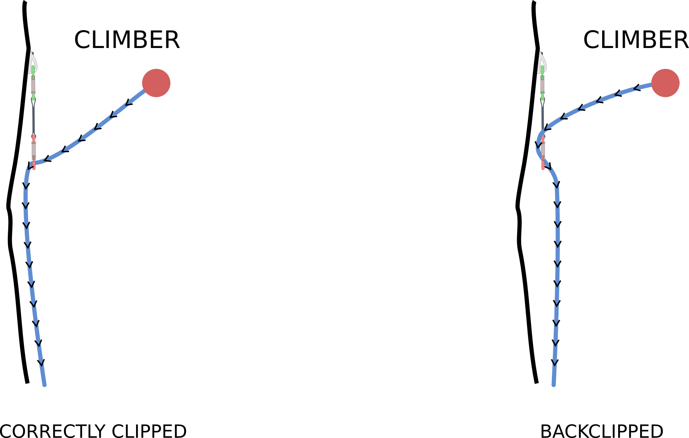

### Z-Clipping

Less common than back clipping, z-clipping is another dangerous mistake that can trip people up.
It's more likely to occur when climbing indoors but can happen anywhere where the bolts are close together.
When you're lead climbing correctly the rope will stretch up from the belayer, through each quickdraw in succession, and up to the climber.
If the bolts are clipped out of order we call it a z-clip.

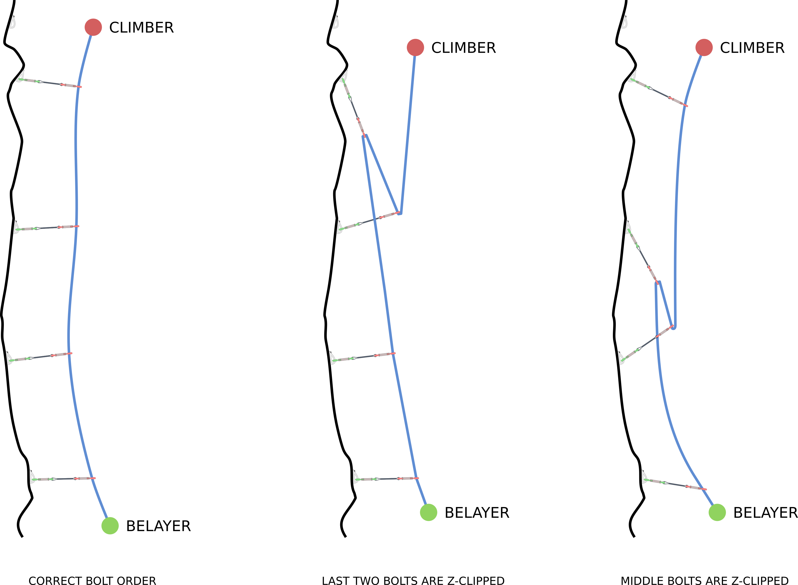

Z-clipping causes a few problems.
If you fall from above a z-clipped bolt, there will be much more slack in the rope than you'd otherwise expect.
This means you're in for a violent fall.
It'd be like you skipped the last bolt altogether.
Even if you don't fall and continue climbing, the z configuration is going to add a lot of extra drag to the rope and make it harder to continue climbing.
If you fall later on in the route, the bottom bolt in the z-clip will be pulled upwards.
Typically they aren't 'designed' for this and if you're using some sort of natural protection there's a good chance it might pull out.

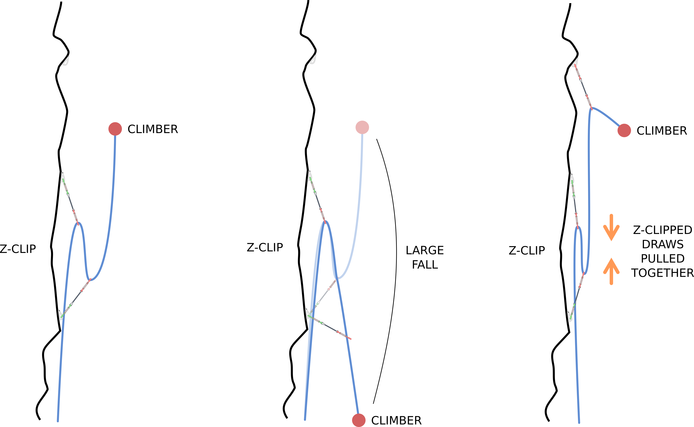

Z-clipping seems like a silly thing.
Of course you clip the bolts in order, that's obvious!
How it typically happens is not that the climber clips the bolts out of order, but rather that he or she clips the wrong piece of rope.
If you reach down pull your rope and accidentally grab behind the previous bolt then you will end up with a z-clip.
This is only really possible if the bolts are close together.

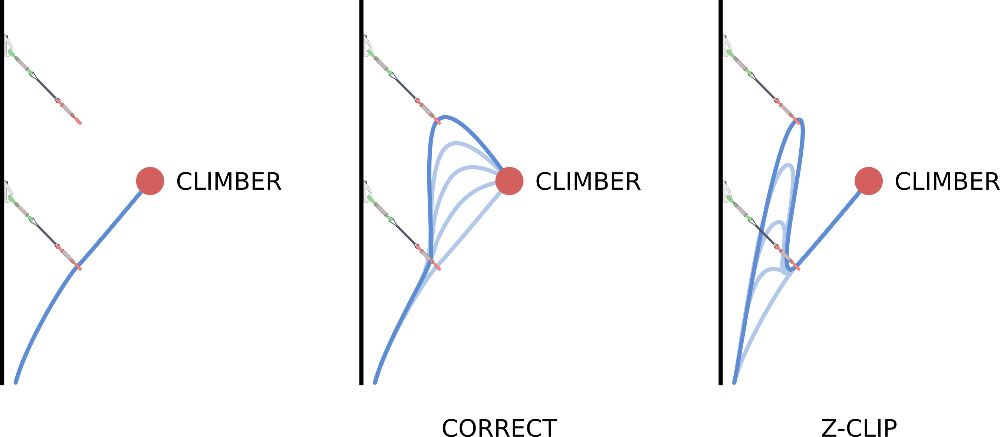

There's a very simple habit that will eliminate the chance of z-clipping.
Whenever you go to clip, start your hand from your tie-in knot and slide it out along the rope.
This ensures you clip the correct strand of rope every time.

### Watch your Feet

The big difference between top rope and lead is that when leading you are often climbing 'above the bolt'.
That is, you're anchored to a point on the cliff that's below you.
Typically lead falls are much further than those on top rope, but this isn't the only concern.
When you fall, you'll fall from above the bolt to below the bolt.
If part of your body gets tangled in the rope as you fall there's a good chance you'll be flipped upside down by the pendulum swing of the rope.

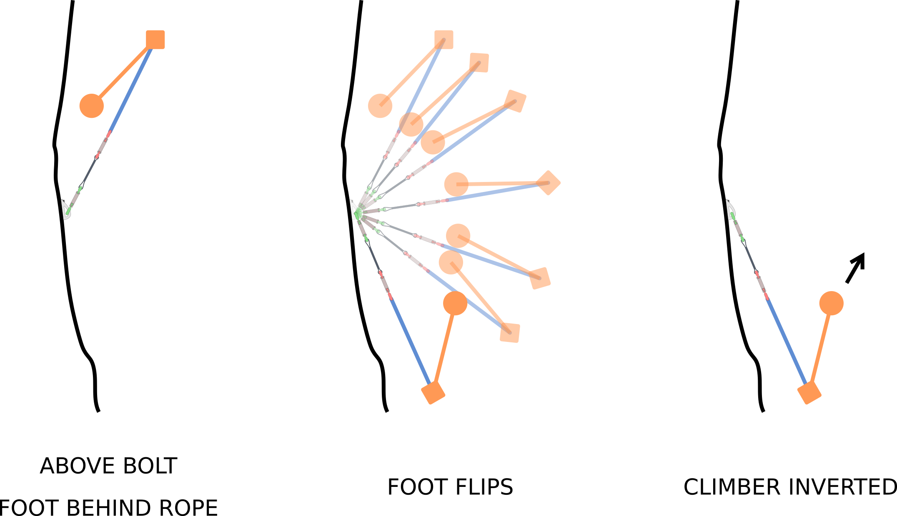

The common advice for leading is "don't step behind the rope".
(Or always step behind the rope, depending on which way your think forward is!)
Perhaps a better way to think about it is that you don't want your feet between the rope and the cliff.
Avoid this and you'll be fine.
It takes practice and vigilance to avoid stepping behind the rope, but you'll thank yourself for it when you fall!

### When to Clip

This isn't a technique exactly, but something worth thinking about.
At what point should you clip the bolt?
When you first start leading the tendency is to clip the bolt as soon as you can reach it.
To feel safe as soon as you can.
It's a surprising result, but this doesn't help anywhere near as much as you'd think.

Let's do the maths.
Imagine two bolts that are a distance `d` apart.
The lower bolt is clipped and you're continuing on to clip the upper bolt.
We'll consider two situations.
In the first situation you climb up just past the upper bolt, go to clip it at waist height, fumble, and fall.
For the second, you stand a distance `x` below the upper bolt and reach up to clip, get pumped, and fall.

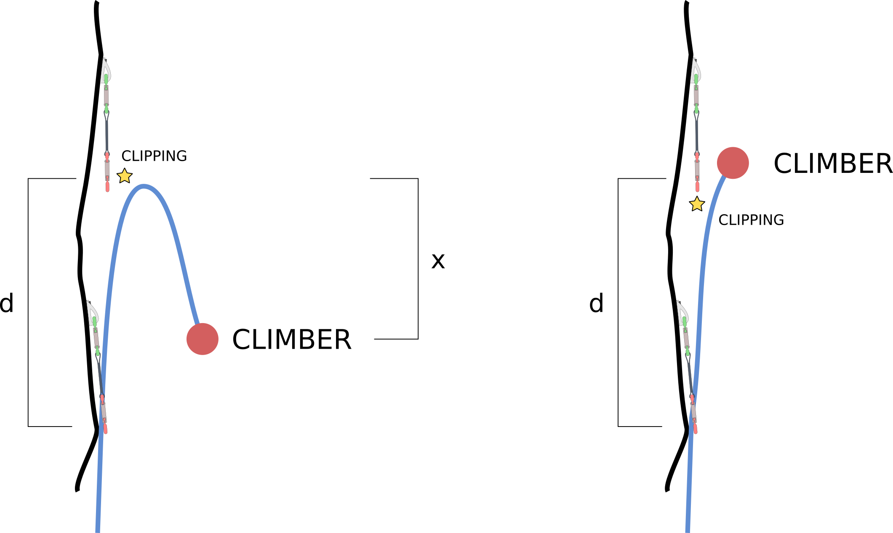

In the first situation you fall a distance of `d` from the upper to the lower bolt, then a further distance `d` below the first bolt until the rope goes taught.
There will also be some rope stretch, but we'll ignore that.
The total fall distance is `2d` and you end up `d` below the lower bolt.

In the second situation you have `d+x` rope stretched out above the lower bolt as the rope goes from your harness to the upper bolt then back down to the lower bolt.
When you fall, you're going to fall `d-x` to the lower bolt and then a further `d+x` until the rope goes taught.
Again ignoring rope stretch, this gives a total fall distance of `2d` and you end up a distance of `d+a` below the lower bolt.

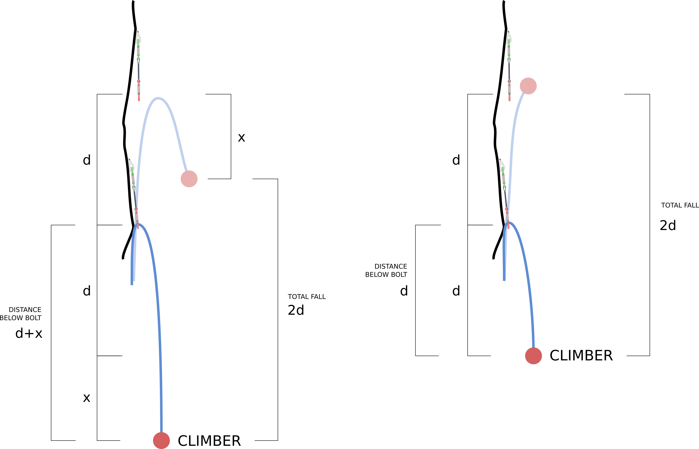

In both scenarios you fall exactly the same distance, however when you were clipping high you actually end up closer to the ground!

What should the takeaway be here?

The big one is that it doesn't really matter when you clip, you'll fall the same amount either way.
What's most important is to find a comfortable position to clip from so you conserve energy.
It's a waste to reach up from a precarious hold to clip high when you could climb up a few more moves and clip from a jug.
Similarly there's no point refusing to clip high from a bomber position out of some misguided attempt to do things the 'right way'.

One time when you should think a little bit about what you're doing is at the second bolt.
Clipping the second bolt of a route is one of the most dangerous parts of a climb.
Depending on how the bolts are spaced there's the potential for a ground fall!
Given this, clipping high is preferable here as in the event of a fall you'd end up further from the ground.
Many routes outside will have a high first bolt which helps alleviate this concern.

One thing that tends to get missed in discussion about clipping high is that the math only applies for when you fall while attempting to clip the bolt.
This is the worst case scenario, when the most slack is in the rope.
If you aren't yet pulling out extra slack, then the intuitive result hold, the higher you are above the bolt, the further you will fall.

### Be Comfortable Falling

Taking a few intentional falls will boost your confidence leading.
After talking someone through all the nitty-gritty details I like to have them do a few falls.
Usually I'll climb and clip up to the third bolt.
Then my partner can climb up, take a few steps above the bolt and let go.
Do have patience when you're doing this, it's easy to forget how scary these first few falls can be!

Remember to focus on falling safely.
This most important cue is to bend your knees and absorb the shock.
Others are spreading your feet and keeping your hands up.
(I can't stress bending the knees enough!)

For your first few falls I'd suggest finding some nice terrain.
My favourite is at the third bolt on a gently overhanging route with no large ledges.
While these falls are going to be a bit of a rush, I hope you'll also enjoy it!

> Disclaimer:
> This page is just my musing about how best to teach people to lead.
> None of it should be misconstrued as actual advice.
> Climbing is dangerous, don't do anything that you haven't personally verified to be safe.
