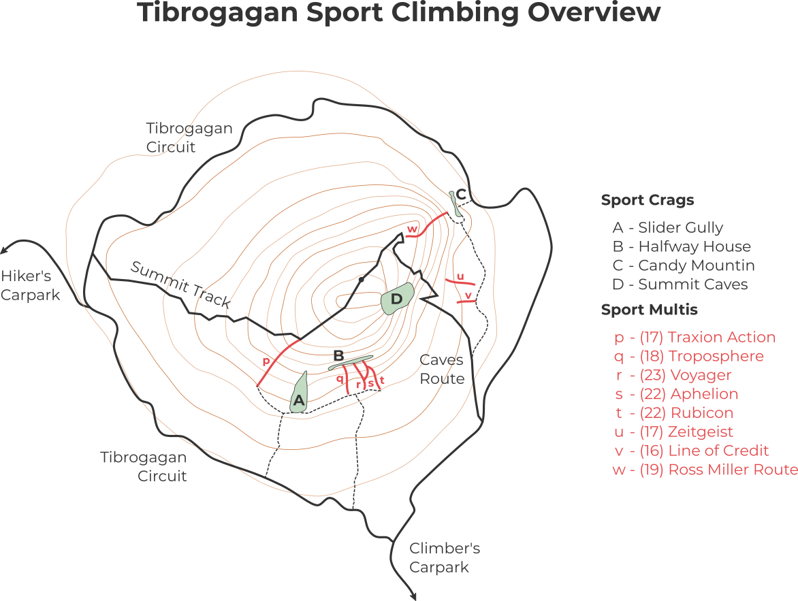

# Tibrogagan Sport Climbing Localities Map

My Tibrogagan has plenty of wonderful sport climbing. 
While most of us could walk to slider blindfolded, finding the other crags and climbs can be a little trickier. 
This localities maps shows the main crags and sport multis on Tibro. 
There are a few others not listed and a whole host of trad climbing, look for those on [The Crag](https://www.thecrag.com/climbing/australia/glasshouse-mountains/tibrogargan). 

Candy Mountain is the best crag for beginners, Slider and Halfway House have great intermediate climbing and the summit cave hosts of whole bunch of tricky routes. 

